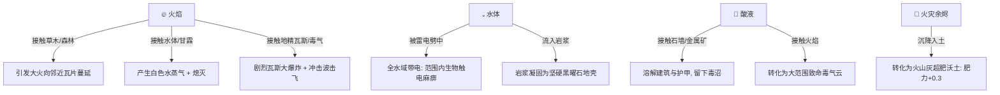

# 《神之蛐蛐缸：万族争霸》模块设计文档：01 世界地质与动态生态系统 (修订版)

> **修订说明 (v2.0)**：已吸收【涌现沙盒系统专家】与【前端架构师】评审意见，重点补全“连续地脉养分扩散场”、“生态质能自平衡循环”与“领地弹簧收缩机制”，彻底根除空间窒息与资源永久枯竭死锁。

---

## 一、 核心设计目标
构建一个具备**动态自愈能力、质能自平衡闭环、物理/元素连锁、以及防止全图窒息**的 2D 像素微缩沙盒网格舞台。
确保在 12 个种族共存的情况下，世界在长达数小时的挂机演化中，既不会出现“野区被瓜分殆尽导致食物链崩溃”，也不会因亡灵/虫族大量吞噬尸体导致全图有机养分单向耗尽。

---

## 二、 地形网格与宏观地貌

### 2.1 网格规格与图层架构
* **基础规格**：56 列 $\times$ 36 行（共 2,016 个基础瓦片），单个瓦片原生像素尺寸为 $24 \times 24$ 像素。世界绝对物理空间为 $1,344 \times 864$ 像素。
* **分层瓦片设计（Multi-layered Tiles）**：
  * **底层（Terrain Layer）**：决定地质物理属性（摩擦力、通行阻力、可燃性、导电性）。
  * **表层（Cover/Resource Layer）**：植被覆盖、矿石、建筑物、流体残留（酸液滩、积雪、落灰）。
  * **地脉场（Subsurface Field Layer）**：由浮点矩阵存储的连续物理场（土壤养分、地表湿度、地温）。

### 2.2 六大地质生态区（Biomes）
```
┌─────────────────────────────────────────────────────────────┐
│ [西北: 荒野裂谷]      │ [北部: 冻土高山]     │ [东北: 远古森海]    │
│  兽人/兽化人营地      │  矮人重石矿山        │  精灵神树圣域      │
│  (粗糙泥土、尖刺灌木) │  (坚硬玄武岩、铁矿)  │  (参天古木、荧光草)│
├───────────────────────┼──────────────────────┼─────────────────────┤
│ [西部: 恶臭泥沼]      │ [中央: 神圣生命泉谷] │ [东部: 遗忘墓园]    │
│  蜥蜴人/真菌人领地    │  各族争夺中立缓冲区  │  亡灵地穴、枯死白骨│
│  (烂泥、剧毒水洼)     │  (神圣泉眼、丰茂果林)│  (受诅咒冻土、墓碑)│
├───────────────────────┴──────────────────────┴─────────────────────┤
│ [南部: 硫磺焦土与地心裂隙]                                         │
│  深渊角魔/地精废土 (熔岩流淌、黑曜石地壳、易燃沼气裂缝)            │
└─────────────────────────────────────────────────────────────────────┘
```

---

## 三、 地脉连续养分场与生态自平衡闭环 (专家新增机制)

### 3.1 连续养分扩散网格（Nutrient Diffusion Field）
彻底废除“在固定瓦片硬编码刷新浆果”的死板机制，改由底层双连续矩阵驱动植被演替：
* **土壤肥力场 $\text{Nutrient}(x, y) \in [0.0, 1.0]$**；
* **地表湿度场 $\text{Moisture}(x, y) \in [0.0, 1.0]$**。

```
              ┌─────────────────────────────────────────┐
              │           地脉养分与植被演替循环        │
              └────────────────────┬────────────────────┘
                                   │
      ┌────────────────────────────┼────────────────────────────┐
      ▼                            ▼                            ▼
[有机物质回流]               [天灾地质赋能]               [自然降水流动]
 尸体风化分解 / 骨粉排泄      雷击落灰化为火山灰           雨水向低洼地汇聚
 养分 +0.4 (半径 2 格扩散)   养分 +0.3 (局部激增)          湿度 +0.5 (全图浸润)
      │                            │                            │
      └────────────────────────────┼────────────────────────────┘
                                   │
                                   ▼
                   【植被演替状态机 (自动进阶/退化)】
      Nutrient < 0.2: 裸露贫瘠土 / 荒漠
      Nutrient 0.2 ~ 0.5: 生长野生杂草 (食草动物初级口粮)
      Nutrient 0.5 ~ 0.8: 演进为【浆果灌木】 (产出甜浆果)
      Nutrient > 0.8: 催生【参天古树 / 药草群落】
```

### 3.2 解决“物质单向熵增枯竭”的再生机制
针对专家指出的“亡灵/虫族大量吞噬尸体、矿石不可再生导致世界资源枯竭”的致命漏洞，设计两重物质回流对冲法则：
1. **亡灵与虫族的“生态税”**：
   * 骷髅劳工随时间缓慢风化（每存在 60 秒脱落微量骨粉），死后碎裂为浓缩骨肥；
   * 虫族母巢排泄的“菌泥废料”，其肥力是普通肥料的 3 倍，使得虫族周边虽寸草不生，但在其巢穴外沿会激增出异常繁茂的野生果林；
2. **地心喷涌与矿脉再生（Geological Upwelling）**：
   * 南部地心裂隙与火山每隔游戏时间 5 分钟发生一次微型“地底喷发”；
   * 喷发不破坏主建筑，而是将冷却的深层岩浆转化为**新生露天铁矿脉与黑曜石块**，彻底杜绝矮人中后期无矿可采的技术断层。

---

## 四、 领地弹簧阻尼与野区保留机制 (防止空间窒息)

### 4.1 空间承载上限矛盾
全图 2,016 块瓦片容纳 12 个种族，极易出现 10 分钟内被占满、中立野区消失、食物链断绝的灾难。

### 4.2 弹簧阻尼维护费机制（Territory Maintenance Decay）
* **领地辐射熵增公式**：
  部族领地以图腾为中心，第 $R$ 圈瓦片每日需消耗部落的维护资源：
  $$\text{Cost}(R) = \text{BaseCost} \times (R - R_{\text{safe}})^2 \quad (\text{当 } R > 4)$$
* **退耕还林自动阻尼**：
  * 当部落人口健康、工匠充裕时，可向外维持 $6 \sim 7$ 格领地；
  * 一旦遭遇战乱、人口减员或粮食短缺，部落无力支付边境战旗维护费；
  * 外围战旗在 30 秒内风化倒塌，地块**自动脱离部落管辖，退耕还林恢复为中立野地**；
  * **硬性系统红线**：全图通过弹簧阻尼机制，**恒久确保全大陆保留至少 $35\%$ 以上的无主中立荒野与河流**，为野生兽群迁徙和浆果生长提供永恒的安全温床。

---

## 五、 元素动态连锁反应网络（更新版）



---

## 六、 微缩生态经济载体与自稳闭环 (专家深度改进版)

为了彻底根治农田绝收灭绝、野生动物被斩尽杀绝、以及掠夺孤岛自残绝后的系统死锁，建立完整的生态自稳网：

### 6.1 农田瓦片与【应急降级代谢网 (Metabolic Fallback)】
* **农田四阶演替**：农耕种族平民在肥力 $\text{Nutrient} \ge 0.4$ 的草地上开辟 $2 \times 2$ 农田（播种 60s $\rightarrow$ 拔节浇水 90s $\rightarrow$ 成熟 60s $\rightarrow$ 休耕 30s）；
* **图腾【应急余种暗格 (Seed Vault)】**：核心图腾永存不可摧毁、不可掠夺的 **$3$ 份原始种核**；
* **降级救灾机制**：
  * 农田全毁且粮仓为 0 时，平民激活【应急采食】：在领地挖掘树皮与草根充饥（饱腹+5，不直接饿死）；
  * 灾情缓解后，图腾自动释放 1 枚种核，由一名平民获【救灾专注】Buff（免疫虚弱减速）优先复垦农田，打破虚弱停摆死循环。

### 6.2 中立野生动物群落与【生态母穴地锚 (Den Anchors)】
* **35% 野区四大不可破坏地貌**：`平原兔洞 (Rabbit Warren)`、`高山羊岩洞 (Goat Crevice)`、`鹿群水坑 (Deer Waterhole)`、`泥沼鱼窟 (Fish Hollow)`；
* **濒危避难潜伏机制 (Refuge Effect)**：
  * 当野外某物种存活数跌至警戒线（如野兔剩最后 2 只、鹿剩 1 只）时，动物 AI 强制判定为【惊恐潜伏态】，以 2.5 极速窜回母穴隐蔽；
  * 隐匿状态下关闭碰撞与渲染，进入 40~60 秒安全育幼期；长成后成群走出母穴漫步全图，彻底杜绝“刷新点蹲守秒杀”与物种灭绝；
* **荒原兽群季节迁徙大潮**：全图动物总数持续低迷超过 120 秒，系统看门狗触发【兽群大迁徙】，一队由 4 头巨角鹿或猛犸组成的过境队伍横穿大陆，为饥荒猎人注入活水。

| 野生猎物 | 栖息地貌 | 行动与习性 | 产出营养物 | 捕食生态张力 |
| :--- | :--- | :--- | :--- | :--- |
| **草地野兔** | 平原与兔洞 | 极高敏捷，受惊窜逃入洞 | 1 份兔肉 (饱腹+30) | 繁殖极快，是初期零星捕猎主力。 |
| **高山岩羊** | 冻土与羊岩洞 | 善于在岩壁跳跃，不易被捕获 | 2 份红肉 + 羊皮 (饱腹+60) | 矮人最爱，羊肉用于酿造烈酒。 |
| **荒原巨角鹿** | 森林与水坑 | 嗅觉灵敏，结群迁徙吃草 | 3 份鲜鹿肉 + 鹿茸 (饱腹+80) | 兽化人围猎目标，群落被吃光迫使其外扩。 |
| **浅水河鱼群** | 河流与鱼窟 | 在水中缓慢游动，遇捕鱼者下潜 | 2 份鲜鱼 (饱腹+50) | 蜥蜴人夜间潜游刺鱼主力口粮。 |
| **中立狂暴野猪** | 中央神圣泉水附近 | 具备 80 HP，受攻击会狂暴反咬冲撞 | 4 份肥肉 (饱腹+100) | 高风险高回报，往往需要猎人组队围杀。 |

### 6.3 部族粮仓【阶梯仓储】与打砸抢博弈
* **双层仓储结构**：
  * **地表货架 (60%)**：可被掠夺者潜行偷窃、打劫搬运；
  * **地下恒温暗格 (40%)**：**绝对不可被偷窃**！只有图腾彻底坍塌全城沦陷时才会被清空，确保被盗部族永远保有一口救命粮；
* **打砸抢与进贡和平博弈 (Danegeld)**：
  * 若掠夺族（地精/绿皮）周边强敌林立、打不过重装盾卫，AI 评估胜率过低时不盲目送死，而是激活【乞讨骚扰】：小人举破陶碗在边境跳脚嚎叫；
  * 若邻国首领仁厚或走长者议会路线，会向边界**丢掷 2 袋面粉（保护费/贡品）**，换取 180 秒互不侵犯协议，实现生草而自洽的外交保种！
