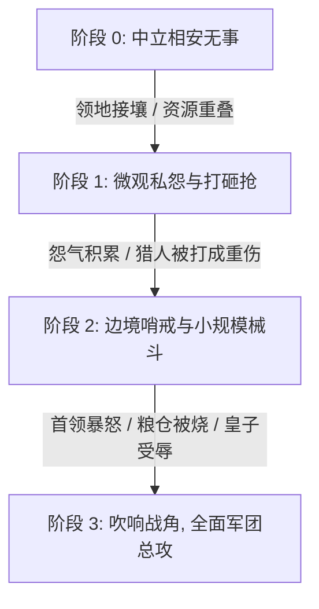

# 《神之蛐蛐缸：万族争霸》模块设计文档：05 领地扩张、摩擦与全面战争 (修订版)

> **修订说明 (v2.0)**：已吸收【战斗数值平衡专家】与【沙盒涌现专家】评审意见，引入**边际递减护甲减伤公式**、**远征军后勤疲劳惩罚**、**四级士气动态状态机**、**图腾 25% 圣盾击退波**以及**战争厌倦度 (War Weariness)**，彻底根治滚雪球秒灭族与永久交火死循环。

---

## 一、 核心战斗数值公式重构 (Anti-Invincibility)

### 1.1 边际递减护甲减伤公式（Diminishing Returns）
彻底废除“花岗岩减伤 60% + 生铁减伤 50% = 绝对免疫物理真伤”的恶性相加漏洞，全面统一推行**非线性收敛公式**：
$$\text{DamageReduction} = \frac{\text{Armor}}{\text{Armor} + 100}$$
$$\text{DamageTaken} = \text{RawDamage} \times (1 - \text{DamageReduction}) \times (1 - \text{CoverMod})$$

* **数值表现**：
  * 护甲 $50 \rightarrow$ 减伤 $33.3\%$；
  * 护甲 $100 \rightarrow$ 减伤 $50.0\%$；
  * 极端高防叠到护甲 $300 \rightarrow$ 减伤 $75.0\%$（永远无法突破 100% 绝对免疫）。
  * 确保任何精锐大将在面对人海集火时，依然会持续受到稳定的最低磨损伤害。

---

## 二、 战争阻尼与防滚雪球机制 (Anti-Snowballing)

### 2.1 远征疲劳衰减光环（Supply Line Attrition）
侵略方军团深入敌境时，每脱离自身图腾辐射圈外 $3$ 格，获得一层【补给线拉长】：
* 移动速度 $-4\%$，伤害输出 $-5\%$，受击硬直 $+8\%$（上限叠算 5 层，衰减至最大 $-25\%$）；
* 压制优势方“一鼓作气横穿地图连灭三族”的滚雪球势头。

### 2.2 图腾濒危【圣火涅槃冲击波（Totem Aegis Protocol）】
当任何部族的核心图腾血量**首次跌至 $25\%$** 时，瞬间触发一次造物主保底机制：
1. 产生强力神圣冲击波，将图腾周围 $6$ 格内的全部敌军强力弹飞出大营，并眩晕 $2.5$ 秒；
2. 图腾生成一层持续 $12$ 秒的金色无敌护盾；
3. 迫使攻城部队重新组织集结阵型，为濒危方争取最后反杀或组织防守的时间。

### 2.3 战争厌倦度与政治反战政变（War Weariness）
* 战争期间，双方部落每日持续累积【战争厌倦度】；
* 厌战度随减员、饥饿与旷日持久大幅攀升；
* **防死锁政治安全阀**：当厌战度突破 $100$ 时，平民拒绝响应出征。若暴怒首领执意强行开战，国内立即爆发**反战政变（Anti-War Coup）**，刺杀好战首领，拥立保守派领袖并向敌国强制递交【停火议和协议】！

---

## 三、 四级士气动态状态机（Morale State Machine）

取消原先粗暴的“0 点全员逃跑”，根据专家意见细化为四级渐进状态机：

```
[状态 1: 稳固 (Solid: 100~60)]
  • 保持正规战斗阵型，弓手掩护，步兵推线。
       │ 承受密集伤亡
       ▼
[状态 2: 动摇 (Wavering: 59~30)]
  • 头顶冒出微汗 💧，攻击攻速 -15%，采取“防御后撤步”，退向掩体。
       │ 阵线被敌军撕穿
       ▼
[状态 3: 惊恐后撤 (Disorganized: 29~1)]
  • 头顶冒出惊叹号 ❗，举盾后退。
  • ★ 退至图腾 5 格内触发【破釜沉舟 (Last Stand)】: 士气锁在 1 点，移速+20%，死战不退！
       │ 最终彻底崩溃
       ▼
[状态 4: 溃不成军 (Routed: 0)]
  • 丢弃重武器头顶冒急汗 💦，全速逃窜；被包围无路可走时转为【跪地投降】。
```

### 3.1 士气扣减平滑化规则
* **目睹死亡距离衰减**：只有 $4$ 格以内的友军阵亡才会扣除士气（$d \le 2$ 扣 3 点，$2 < d \le 4$ 扣 1 点）；
* **3 秒滑动时间窗封顶**：单个小人在 3 秒内因目睹友军阵亡最多扣除 **$15$ 点士气**，彻底避免敌方一记大招秒杀 5 个人导致全军瞬时 0 士气崩溃！
* **首领被斩首**：扣除 $25$ 点，阵中若有勇士接任帅印，立即回补 $+15$ 点稳定军心。

---

## 四、 边境摩擦与战争爆发阶梯推进机制 (Friction Escalation Ladder)

两族全面战争绝非凭空爆发，而是从“争抢一块肉”、“偷一袋麦子”逐步升级为百人同屏军团决战：



### 4.1 阶段 1：三大微观导火索场景
1. **【争抢鹿肉与猎场重叠】**：
   * 荒原兽化人与高山矮人在中立林地同时发现了一头重伤的巨角鹿。双方猎手同时射箭击中，在鹿尸旁拔刀对峙；
   * 绿皮拾荒者趁乱抢走鹿腿，矮人暴怒一铁镐砸断兽人猎手脚踝，双方结下【咬耳断腿】宿怨！
2. **【打砸抢与粮仓失窃】**：
   * 地精潜行偷摸潜入人类麦田，搬走整袋面粉并顺手点燃了草棚；人类巡逻队敲响铜锣围堵，当场击毙两名地精斥候；
   * 地精首领在图腾前嚎啕大哭，发誓让所有人类“尝尝自制土瓦斯的滋味”。
3. **【边界筑墙推搡碰撞】**：
   * 矮人重石围墙与兽骨营地边界碰撞，双方石工与苦力因争夺一块铁矿脉用石锤互砸脑袋。

### 4.2 阶段 2：边防哨戒与小队摩擦 (Skirmish)
* 双方外交好感度降至 $-50$；
* 领地边缘各自设立哨戒栅栏，由生活职业退回二线，民兵与前排盾卫（3~5人）常驻边境巡逻；
* 任何越境生物立即遭受远程箭矢齐射警告。

### 4.3 阶段 3：战争长鸣与军团冲锋 (Total War)
* **战争倒计时归零触发点**：
  * 首领特性为【残暴暴君】时极易单方面撕毁条约；
  * 某方皇子或大将死于边境小队械斗；
  * 玩家上帝吹响【挑唆圣战号角】。
* **军团动员**：全族 80% 兵力完成武器整备，战线流场寻路生成，大军以排山倒海之势向敌方图腾发起总攻！
