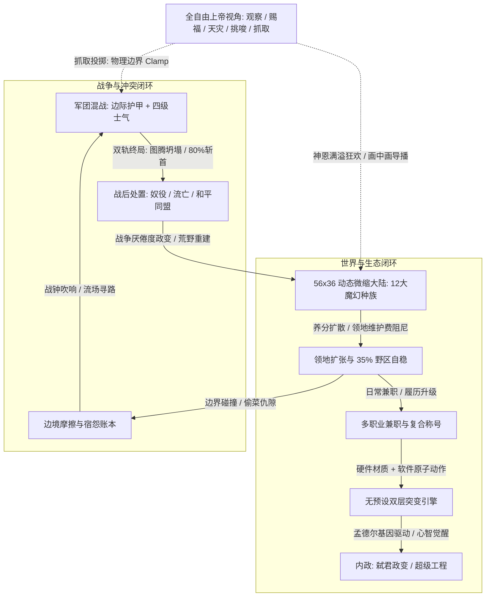

# 《神之蛐蛐缸：万族争霸 (God's Terrarium: Race Wars)》全量总策划案 (Master GDD v3.0 活体文明涌现版)

> **版本**：v3.0 活体文明涌现与全系统有机串联大重构版  
> **体系**：涵盖 1 份总览 GDD 与 9 本系统深度专册，全量吸收 10 位跨学科专家联合评审成果，完全贯彻“零虚空属性（Zero Stat Bloat）原则”、“自下而上物理涌现”与“文明生长有机闭环”。  
> **技术基线**：原生 HTML5 Canvas 2D + ES6 Modules + 原生 Web Audio API（零外部依赖、双击秒开、60 FPS 满帧、千人同屏）。

---

## 目录
1. [游戏总体概述与核心定位](#一-游戏总体概述与核心定位)
2. [九大系统专册架构索引与映射](#二-九大系统专册架构索引与映射)
3. [全自由上帝沙盒与导播系统](#三-全自由上帝沙盒与导播系统)
4. [大陆世界网格与生态连续场](#四-大陆世界网格与生态连续场)
5. [12 大魔幻种族与生存代谢范式](#五-12-大魔幻种族与四大生存代谢范式)
6. [多职业兼职与复合流派系统](#六-多职业兼职与复合流派系统)
7. [无预设突变引擎与孟德尔基因驱动](#七-无预设突变引擎与孟德尔基因驱动)
8. [领地扩张、战线推移与士气重构](#八-领地扩张战线推移与士气重构)
9. [国家治理树、政治张力与分裂内战](#九-国家治理树政治张力与分裂内战)
10. [三声道黑色幽默战报与宿怨网络](#十-三声道黑色幽默战报与宿怨网络)
11. [像素视觉管线、Web Audio与前端高性能规范](#十一-像素视觉管线web-audio与前端高性能规范)
12. [QA 9 大致命断言与工业级安全防线](#十二-qa-9-大致命断言与工业级安全防线)
13. [文明建立、动态领地与全系统有机涌现](#十三-文明建立动态领地与全系统有机涌现-v30-核心演进)

---

## 一、 游戏总体概述与核心定位

### 1.1 核心一句话定位
一款融合了 **“微缩沙盒生态模拟”**、**“自下而上无预设物理突变”**、**“履历自生成多职业兼职”** 与 **“阵营全面军团大混战（群体斗蛐蛐）”** 的 2D 像素风上帝模拟器。

### 1.2 四大设计哲学与商业护城河
1. **类型 3：全自由上帝沙盒（Deus Ex Machina）**：
   * 玩家兼具“创世造物主”、“拉偏架亲爹”、“中立斗蛐蛐看客”与“天灾乐子人”多重身份；
   * “生物绝对自由，规则法理锚定”：小人可随意抓取投掷空投，核心图腾作为法理之锚刚性锁死。
2. **高观赏性挂机与心流节奏**：
   * 挂机 30 分钟不枯燥：生态循环、私怨斗殴、宫廷政变、超级武器研发自发演进；
   * 配置【智能导播画中画】消除 FOMO 焦虑，【神恩满溢狂欢时刻】提供周期性高潮爆发。
3. **自下而上的无预设物理涌现（Emergence）**：
   * 硬件层（物理材质+解剖器官）与软件层（原子动作积木）笛卡尔积自由拼装；
   * 受上下文无关文法（CFG）与效用-混乱双门限过滤，兼顾极致生草与逻辑自洽。
4. **《矮人要塞》式的严肃解剖学荒诞叙事**：
   * 三声道多角度实时记录微观损伤与宏观更迭，生成带 16 位基因符文码的二创物种海报。

---

## 二、 九大系统专册架构索引与映射

为确保系统各模块的极端深耕与边界自洽，全案由 9 册独立设计规范支撑：

| 专册编号 | 专册名称 | 核心职责与关键升级 |
| :---: | :--- | :--- |
| **[01]** | [世界网格与生态代谢](file:///Users/yuhaomiao/Documents/antigravity/Game/docs/01_world_and_ecology.md) | 地脉养分连续扩散场、中立动物母穴、应急降级代谢网、粮仓40%暗格保底、35%+ 中立野区自稳。 |
| **[02]** | [种族文明与日常生态](file:///Users/yuhaomiao/Documents/antigravity/Game/docs/02_races_and_civilization.md) | 四大生存代谢范式、亡灵命匣继承法、魔像固件分叉与石化消亡、古代遗迹化解耦、质量碰撞矩阵。 |
| **[03]** | [职业体系与多职业兼职](file:///Users/yuhaomiao/Documents/antigravity/Game/docs/03_professions_and_multiclass.md) | 履历自然兼职、复合称号矩阵、四大恶性流派修复（ICD $\ge 1.5$s、税后反伤、备用短刀保底）。 |
| **[04]** | [突变引擎与进化算法](file:///Users/yuhaomiao/Documents/antigravity/Game/docs/04_mutation_and_evolution_engine.md) | 动作通道仲裁协议、CFG 产生式掩码、双倍体孟德尔基因驱动平滑同化、分裂滞后回线。 |
| **[05]** | [领地扩张、摩擦与军团大战](file:///Users/yuhaomiao/Documents/antigravity/Game/docs/05_territory_and_warfare.md) | 边境摩擦三阶升级阶梯、边际递减护甲、远征疲劳光环、四级士气状态机、图腾 25% 圣盾击退波。 |
| **[06]** | [战后处置、内部政治与分裂内战](file:///Users/yuhaomiao/Documents/antigravity/Game/docs/06_post_war_and_internal_politics.md) | 双轨科技与市政树、Voronoi 聚落双核切分、叛军自由之怒Buff、防碎片化四协议、绝嗣兜底、基因防伪。 |
| **[07]** | [上帝沙盒交互与神力系统](file:///Users/yuhaomiao/Documents/antigravity/Game/docs/07_god_powers_and_interaction.md) | 图腾不可抓取锁、刚性边界Clamp、天命悬空与神威反噬防死锁、画中画导播、神恩满溢狂欢时刻。 |
| **[08]** | [编年史与矮人要塞式生草战报](file:///Users/yuhaomiao/Documents/antigravity/Game/docs/08_chronicle_and_narrative.md) | 严肃解剖学荒诞、三声道播报、帝国验尸小票、极乐迪斯科临终碎碎念、16位分歧基因种子码。 |
| **[09]** | [美术、音效与前端技术规格](file:///Users/yuhaomiao/Documents/antigravity/Game/docs/09_art_audio_and_technical_spec.md) | 7:2:1色彩律、Doll Stamp Cache贴图缓存、Web Audio安全压限、零GC空间哈希、流场寻路、QA 9 大断言。 |

---

## 三、 全自由上帝沙盒与导播系统

### 3.1 视口漫游与智能导播
* **无极平滑缩放 ($0.35\times \sim 3.0\times$)**：像素硬采样（`pixelated`），宏观纵览阵营色晕，微观尽显小人咀嚼表情。
* **智能导播画中画 (Live PiP)**：当视野外发生【首领单挑】、【图腾圣盾被打破】、【极品突变】时，右上角弹出 $160 \times 120$ 像素画中画特写，点击平滑平移至主战场。

### 3.2 实体神之手（物理交互安全边界）
1. **图腾绝对不可抓取锁**：核心图腾为世界法理几何之锚，鼠标拖拽触发金色神圣锁链震颤并弹回，杜绝秒杀作弊；
2. **世界边缘刚性截断 (Clamp)**：坐标严格限制在 $[12, W-12]$ 与 $[12, H-12]$，杜绝小人被丢入虚空或产生 `NaN`；
3. **防穿模回弹**：误入高山或建筑核心时，落地瞬时触发 BFS 推挤至最近合法可行走瓦片；
4. **动作打断与幽灵判定清理**：被抓起瞬间挂起行为树、清空攻击 Hitbox，重置内置冷却；
5. **天命悬空与神威反噬防死锁**：若老皇帝驾崩时选中的继承人恰好被上帝之手抓在半空，加冕事务进入天命悬空。抓取超 5 秒自动触发神威反噬震脱神之手，赋予金身霸体安全着陆加冕，彻底杜绝王权死锁。

### 3.3 神恩满溢狂欢时刻（Divine Overdrive）
* 挂机累积【神恩值】达到 $100\%$ 时，可开启持续 15 秒的狂欢时刻：
* 神力零冷却、零消耗狂甩；全图小人进入狂喜状态（移速+50%、生草技能概率+200%）；末尾绽放像素礼花并生成《狂欢纪元快报》。

---

## 四、 大陆世界网格与生态连续场

### 4.1 $56 \times 36$ 微缩世界网格与六大生物群系
包含温带森林、高山矿脉、深浅水域、腐蚀沼泽、地心熔岩与神圣泉眼。

### 4.2 连续地脉养分扩散场与应急降级代谢网
* **养分扩散场**：引入 $56 \times 36$ 的浮点数养分连续矩阵 $N(x, y)$。动植物遗骸依据拉普拉斯算子向四周渗流扩散，驱动植被循环再生，根除荒漠化死锁；
* **中立动物母穴地锚**：地图设 4 类不可破坏的中立母穴（兔洞/岩洞/深水窟/沼泽泥潭），濒危时启动“隐匿育幼”闭门繁殖，成群复出，防止食物链断裂绝种；
* **应急降级代谢网**：农田被烧时平民自动啃树皮挖草药、捕猎落空时挖掘昆虫陷阱、掠夺无果时搜刮垃圾堆，维持最低生存线；
* **粮仓 40% 地下暗格不可盗窃保底**：杜绝被强盗一次偷光引发种族全灭。

### 4.3 领地维护费弹性阻尼（35%+ 中立野区自稳）
* 领地维护费呈二次方递增：$\text{Upkeep} = k_1 \cdot \text{Area} + k_2 \cdot \frac{\text{Area}^2}{\text{Pop}}$；
* 人口战损后领地边界自动收缩（退耕还林），全图永久保留 35% 以上的公共中立缓冲区，保证野兽繁衍与食物链安全。

---

## 五、 12 大魔幻种族与四大生存代谢范式

彻底打破单一吃浆果设定，确立四大生态代谢模型：
* **🌾 农耕开垦型（人类、精灵、真菌人）**：开辟农田，播种收割粮食草药入仓，供养繁衍；
* **🏹 野性捕猎型（兽化人、蜥蜴人、矮人）**：猎杀野生鹿/羊/鱼，大口吃肉，野兽吃空则向外抢占猎场；
* **🔥 掠夺拾荒型（地精、绿皮、角魔）**：极度缺乏农业耐心，自带掠夺本能，偷鸡摸狗抢邻居仓库，断粮则族内互掐；
* **⚡ 无机/死灵型（亡灵、魔像、魔眼）**：免疫有机饥饿，亡灵吸收尸体死气，魔像需矿脉充能。
  * **亡灵【命匣继承法】**：灵魂寄宿于实体命匣，命匣碎裂则由大巫妖献祭死气争夺白骨王冠；
  * **魔像【固件分叉与断电石化消亡】**：逻辑矩阵分歧分裂为肃正派 vs 守望派；断能 180 秒石化每秒扣 2% HP 风化为矿石；
  * **中立古代遗迹化解耦**：无活动单位的石化魔像转为 `NEUTRAL_RUINS`，释放国家名额，杜绝 16 国硬锁被死锁占满。

### 12 基础种族全量参数矩阵

| 种族全称 | 生存代谢范式 | 质量 Mass | 基础士气 | 挂机日常画卷 | 种族变异禁忌掩码 |
| :--- | :---: | :---: | :---: | :--- | :--- |
| **人类帝国 (Humans)** | 🌾 农耕开垦型 | 50 (1.0) | 50 (标准) | 砍树建房、开垦麦田、磨坊巡逻 | 无禁忌 (万金油适应) |
| **绿皮菌兽 (Orcs)** | 🔥 掠夺拾荒型 | 85 (1.4) | 70 (狂躁) | 摔跤角力，断粮互殴，越境偷猪 | 优雅灵巧系、树皮 |
| **森灵精灵 (Elves)** | 🌾 农耕开垦型 | 40 (0.8) | 45 (爱生) | 照料神树苗圃，祈祷跳舞催生草药 | 易燃瓦斯、重度机械化 |
| **高山矮人 (Dwarves)** | 🏹 捕猎酿造型 | 90 (1.6) | 65 (顽石) | 敲矿筑墙、猎高山岩羊、地窖熬烈酒 | 薄膜虫翅、轻质羽翼 |
| **墓园亡灵 (Undead)** | ⚡ 无机死灵型 | 35 (0.9) | 100 (无畏) | 白天假死，夜间挖骨拼装骷髅犬 | 活性圣血、草木光合 |
| **狂躁地精 (Goblins)** | 🔥 掠夺拾荒型 | 25 (0.5) | 30 (狡黠) | 翻垃圾桶、偷矿偷肉、乱搓自制炸药 | 花岗岩厚重、威严光环 |
| **深渊角魔 (Demons)** | 🔥 掠夺拾荒型 | 80 (1.3) | 75 (嗜虐) | 围岩浆烤火、猎兽投入祭火造焦土 | 水栖肺、冰霜之拥 |
| **沼泽蜥蜴人 (Lizardfolk)** | 🏹 野性捕猎型 | 55 (1.1) | 50 (审慎) | 泥滩晒太阳，夜间潜游刺鱼挂风干架 | 生铁易锈、地心焦黑 |
| **荒原兽化人 (Beastmen)** | 🏹 野性捕猎型 | 75 (1.5) | 60 (野性) | 举族奔行迁徙、围猎野牛分食生肉 | 机械化、精密射击 |
| **孢子真菌人 (Sporelings)** | 🌾 农耕开垦型 | 45 (0.7) | 80 (麻木) | 铺菌毯、堆腐殖土培植发光毒蘑菇 | 极度干燥、灼热熔岩 |
| **晶石魔像 (Golems)** | ⚡ 无机充能型 | 160 (2.5) | 100 (坚毅) | 原地方尖碑充能，缺矿石石化成雕像 | 一切血液体液、有机器官 |
| **深渊拟态魔眼 (Aberrations)** | ⚡ 无机心智型 | 30 (0.6) | 55 (低语) | 虚空悬浮，触手吸取路人精神心智 | 笨重石肤、骨骼四肢 |

---

## 六、 多职业兼职与复合流派系统

### 6.1 履历自然兼职机制
小人开局具备 1 个初始生活职业（农夫/矿工/拾荒者/学徒）。在漫长的生存与战斗经历中，满足阈值自发觉醒第二职业：
* 伐木工在边境被狼咬断腿，手持砍刀连续反杀 3 只狼 $\rightarrow$ 顿悟觉醒兼职【狂战士】，晋升复合头衔：**【嗜血狂暴林业长】**！
* 矿工长期在地下挖矿遭受落石击打，且体表长出花岗岩甲壳 $\rightarrow$ 顿悟兼职【铁壁盾卫】，晋升复合头衔：**【花岗岩重装筑城工】**！

### 6.2 四大恶性破坏流派修复规范（专家平衡仲裁）
1. **全局内置冷却 (ICD $\ge 1.5$s)**：所有受创/挨打触发技能强制挂钩 1.5s 内置冷却，彻底根除“0 CD 挨打自爆秒一切”；
2. **税后反伤机制**：荆棘反伤计算基准为经过受击者护甲减免后的实际有效伤害，杜绝“1000 护甲反弹 100% 原始伤害”的无敌刺猬流；
3. **备用匕首保底**：被缴械单位自动拔出伤害衰减 50% 的短刀，绝不挂起或卡死在无武器状态；
4. **单次殉道限制**：自爆/献祭技能执行后，实体生命值强制清零并销毁，无法通过同帧治疗循环永动。

---

## 七、 无预设突变引擎与孟德尔基因驱动

### 7.1 双层突变架构（Hardware + Software）
* **硬件层**：表皮材质（花岗岩/树皮/几丁质/水银）、体内体液（强酸/易燃高压瓦斯/圣水）、外挂器官（复眼/骨刺/昆虫翼/毒囊）；
* **软件层**：触发器（挨打/暴击/濒死/落水） + 动作原子（冲撞/滑翔/吐酸/火箭喷射） + 元素通道 + 生草代价（平地摔/反胃眩晕/脱水）。

### 7.2 上下文无关文法（CFG）与动作通道仲裁
* 引入三轨动作仲裁器（Movement / Cast / Defense），同轨互斥（如：禁止一边滑翔一边装死）；
* 部署效用期望与混乱方差双门限，过滤 100% 纯自残词条，保留高风险高笑点的生草神技。

### 7.3 双倍体孟德尔基因驱动（Soft Assimilation）
* 废除模式 A 弑君后 100% 暴力瞬间重写全族基因的毁灭性设定；
* 模式 A 开启后，新突变作为“显性基因”注入氏族受精卵池，通过 2~3 代自然选择与战场淘汰逐步扩散，劣质突变自然沉降，保留隐性基因库多样性。

---

## 八、 领地扩张、战线推移与士气重构

### 8.1 边境摩擦三阶升级阶梯
生存摩擦逐步升级，告别无脑开战：
1. **一阶·微观摩擦**：偷肉抢粮、猎物争夺，小人单挑或斗殴，败者逃窜；
2. **二阶·筑墙争端**：领地重叠碰撞，工匠筑墙互掷石块，触发边境互殴；
3. **三阶·军团宣战**：因果宿怨积累满或图腾受击，敲响战钟，大军拔营总攻！

### 8.2 边际递减护甲与远征疲劳光环
* **护甲公式**：$\text{DR} = \frac{\text{Armor}}{\text{Armor} + 100}$，免伤无限逼近但绝不达到 $100\%$；
* **远征疲劳**：远离图腾超 15 格每多走 1 格移速 $-3\%$，受创士气惩罚 $+5\%$；敌方图腾 HP $<25\%$ 释放【图腾圣火击退波】。

### 8.3 四级士气状态机与战争厌倦度
1. `稳固 (100~60)`：战阵严整；
2. `动摇 (59~30)`：举盾后退，间隔 $+50\%$；
3. `惊恐 (29~1)`：绝地胡乱冲撞；
4. `溃退 (0)`：丢弃主武器四散奔逃或跪地投降；
* **战争厌倦度**：两军交火超 180 秒无领地变动，厌战值满爆发反战罢工或政变休战。

---

## 九、 国家治理树、政治张力与分裂内战

### 9.1 轻量双轨国家治理树（Tech & Civic Tree）
* **生产与军事实用科技三阶梯**：
  * **阶梯 I：初民工具**（水渠苗圃/骨矛陷阱/撬棍偷窃）；
  * **阶梯 II：城邦基建**（精铁盾墙/恒温粮仓/共鸣祭坛）；
  * **阶梯 III：奇迹战略工程**（解锁矮人轨道巨炮、地精飞艇、比蒙巨兽、战争古树）。
* **四大市政意识形态路线**：
  * **👑 血统世袭皇权 (Hereditary Dynasty)**：法统神圣，皇亲继承，阶层稳定。 ★ **核心机制：充满未知的继承大随机性**！包含【皇子体质盲盒】（神力蛮王/咳血弱质/变异怪胎/酒鬼/私生子）与【老皇驾崩意外大转盘】（顺位即位 40%、离奇暴毙被野猪反杀 15%、幼主摄政 15%、双胞胎抓阄 15%、荒野私生子夺门 15%）。
  * **⚔️ 军阀强权独裁 (Military Autocracy)**：以战功与角斗为尊，全军攻击力+25%；首领衰弱极易引发部下弑君政变。
  * **🏛️ 长者议会共和 (Elders' Council)**：行业宗师共治，科研+50%、民生繁荣；战时决断迟缓，易党争分裂。
  * **🕊️ 狂信神权国度 (Theocratic Orthodoxy)**：视上帝为唯一至高真神，祈祷神恩翻倍；将异教徒视为宿敌，对外必战。
* **极简设计铁律：零额外虚空属性（Zero Stat Bloat）**：
  * 坚决不设繁杂死板的政治力、魅力、统治度等假属性面板；
  * 所有统治、继承与政变事件，**100% 依托小人现有的物理对象属性（生命值 HP、质量 Mass、年龄、饥饿度、外挂变异器官、手持装备）**与轻量离散事件驱动，轻巧而涌现极高！

### 9.2 统治者个性词条与政治张力模型（Political Tension）
* 统治者拥有【残暴暴君】、【正统皇子】、【激进改革家】、【守旧石顽】、【野心军功将】等性格；
* 当既定市政路线与新统治者特性冲突时（如议会选出暴君，或军阀独裁硬传懦弱皇子），累积**政治张力值 (Tension, 0~100)**。

### 9.3 图腾大分裂与皇子夺嫡内战（The Great Schism & Succession War）
* **Voronoi 聚落双核切分法**：以主基地与次要塞为发生核进行 Voronoi 扩散切割，孤岛飞地自动平滑修剪重置为中立荒原，杜绝悬崖孤岛与寻路 `NaN`；
* **叛军【自由之怒】45s Buff**：攻速 $+30\%$、移速 $+20\%$、免疫士气溃散，持续 45 秒，对冲正统派 80% 禁卫军优势；
* **四大防碎片化协议**：人口 $\ge 12$ 门槛、5 分钟分裂冷却、飞地自动坍塌、全图 16 国硬锁（满员时张力转为暗杀决斗）；
* **绝嗣角斗空盘重铸**：老皇驾崩无储君时，自动一行代码按 `Mass * HP` 选出全族第一硬汉登基，市政自然转为军阀独裁；
* **双等位基因掩码防伪**：私生子夺门认亲必须通过存活、非亡灵、父系 ID 与基因掩码三断言；
* **继承原子事务锁**：老皇咽气到新君即位锁定 3.0 秒事务窗，防并发双王死锁。

### 9.4 战后处置五重收束与流寇生态位
对外战争终局结算依首领性格执行：
1. **【野蛮奴役】**：战败者带枷锁采矿，设奴隶怨气值，蓄满突围独立；
2. **【文明同化】**：和平共处，保留战败族特色建筑，享受一等公民待遇；
3. **【二等附庸】**：保留自治图腾，每季向宗主国上贡 30% 矿石与粮食；
4. **【驱逐流放与弱小乞讨】**：残兵携图腾火种流亡；战力悬殊弱小强盗绝对禁止正面自杀送死，转为在帝国边境商路收取过路费或在粮仓外乞讨，保留生存空间；
5. **【彻底吞噬】**：菌兽/亡灵将尸骸吞食殆尽，全族获得基因同化点数。

### 9.5 超级战略奇迹工程尺度硬上限
* 地精自制飞艇：30% 几率升空自毁；
* 矮人轨道巨炮：最大有效射程锁定为 14 格（防跨图秒杀）；
* 远古比蒙巨兽：每日需投喂 5 份肉食，饥饿狂暴踩碎自家族人；
* 战争古树古卫：占地 $2\times2$，极度怕火，点燃后狂奔踩踏。

---

## 十、 三声道黑色幽默战报与宿怨网络

### 10.1 三声道人格叙事系统
彻底告别单调机械复读，文本引擎由三位极具语言风格的观察者轮流发声：
* **【声道 A: 解剖学法医】**：以冰冷客观的手术台解剖学口吻记录骨骼碎裂、韧带撕裂与酸液腐蚀；
* **【声道 B: 崇高虚无诗人】**：以史诗神话、古老悲剧哀叹英雄陨落、帝国兴替与命运的戏谑；
* **【声道 C: 冷酷官僚审计员】**：以无情的数据报销、资产折旧、赔偿清算做黑色幽默附注。

### 10.2 叙事衍生载体：验尸单与极乐迪斯科风思维阁
* **【发黄带血渍的帝国官僚验尸小票】**：重要角色阵亡点击可展开，列明颅骨受损厘米数、生前欠缴肉干数与抚恤金扣除公文；
* **【临终神经碎碎念卡片】**：领袖咽气瞬间，脑内【古老爬行脑】、【野心意志】、【食欲本能】与【骨骼肌肉】展开黑色幽默辩论。

### 10.3 宿怨账本图谱（The Blood Ledger）
每个小人记录至多 3 条重大创伤仇怨（被谁咬掉耳朵、被谁烧了房子）。混战中偶遇仇敌瞬间激发【宿仇狂暴】，打出专属金框因果清算战报。

### 10.4 宏观《纪元公报》横幅与 16 位分歧点基因种子码
* 发生弑君、自爆或灭国时，屏幕上方徐徐展开羊皮纸公报定格播报；
* 点击小人支持一键生成带 24x24 像素肖像与 **16 位分歧点基因种子码（如 `#E8A2-F04C-99B1-D330`）** 的物种标本海报，方便玩家社区分享踢馆。

---

## 十一、 像素视觉管线、Web Audio与前端高性能规范

### 11.1 2D 像素视觉规范（7:2:1 色彩面积律）
* **色彩金字塔**：70% 躯干底色、20% 阵营标志色、10% 突变发光重音，拒绝杂乱马赛克；
* **领袖识别**：酋长身长突破 4px，头顶佩戴华丽羽冠，脚踩动态阵营光环；
* **打击反馈**：2 帧像素纯白闪烁（Flash White）+ 1px 水平微震，力量感拉满且极其节省 Draw 消耗。

### 11.2 Web Audio 工业级信号拓扑
* 纯原生振荡器与白噪声实时数学合成，零外部音频文件；
* 末端强制配置 **DynamicsCompressorNode** 安全压限器，彻底杜绝爆音破音；
* 16 轨复音池配额调度，超出施加 8ms 极速微淡出；
* 伴随微弱温润的生态白噪音（风声水滴），消除挂机听觉疲劳。

### 11.3 60 FPS 满帧四大前端技术落地
1. **离屏贴图化缓存 (Doll Stamp Cache)**：仅在变异/换装时拼绘 1 次，主循环单次 `drawImage`，GPU 开销由 22ms 降至 1.8ms；
2. **静态世界背景预烘焙**：网格地图仅绘制 1 次至离屏 Canvas，地表破坏使用局部脏矩形更新；
3. **零 GC 紧凑静态链表空间哈希**：TypedArray（`Int32Array`）实现分桶单链表，每帧 0 垃圾分配；
4. **大军团流场寻路 (Vector Flow Field)**：攻城军团反向 BFS 一次生成全图方向向量场，小人查表移动，计算复杂度降至 $O(1)$。

---

## 十二、 QA 9 大致命断言与工业级安全防线

为保证沙盒连续运转数天数夜不卡死崩溃，底层强制植入 9 大守门断言规范：

1. `TC-EDGE-01`：**递归受创深度硬断言**（链式受创深度 $\le 3$ 熔断，杜绝反伤无限自咬死循环）；
2. `TC-EDGE-02`：**物理边界刚性 Clamp**（禁止实体坐标产生负值、越界或 `NaN`）；
3. `TC-EDGE-03`：**图腾法理锚定锁**（底层直接拦截针对基地图腾的物理拖拽指令）；
4. `TC-EDGE-04`：**战争交火超时看门狗**（交火超 180 秒自动注入战争厌倦度强制休战破局）；
5. `TC-EDGE-05`：**阵营灭亡资源彻底回收**（老巢覆灭清算法理色块，残兵改写为流寇，杜绝悬挂孤儿实体）；
6. `TC-EDGE-06`：**领地拓扑双向连通性断言**（Voronoi 分裂后强制校验，绝壁孤岛自动重置为中立荒原，防寻路 `NaN`）；
7. `TC-EDGE-07`：**继承权原子事务与防重入锁**（老皇驾崩与新君加冕间锁定 3.0s 事务窗，杜绝并发双王死锁）；
8. `TC-EDGE-08`：**仓储物料守恒断言**（分裂分家、抢劫与缴获前后总量绝对守恒，杜绝刷粮刷铁 Bug）；
9. `TC-EDGE-09`：**阵营普查休眠解耦断言**（石化魔像等休眠实体移出活跃政权普查，释放全图 16 国硬锁名额）。

---

## 十三、 文明建立、动态领地与全系统有机涌现 (v3.0 核心演进)

为彻底解决底层模块各自为战、系统割裂的“孤岛危机”，v3.0 确立了**活体文明生长全生命周期闭环**：

### 13.1 六大生态群系自适应营火选址与建立 (Founding by Biome Affinity)
彻底废除开局机械 4x3 平铺 12 个固定圆圈的僵化模式：
* 12 始祖部族依据天然栖息地亲和力（矮人高山、精灵森海、兽人荒原、亡灵墓园、地精焦土、人类泉谷）寻觅最宜居水源与土地；
* 建立部落之初，仅生成一簇**先祖营火与法理图腾**，初始领地半径仅 $R=2$ 格，初始人口仅 4~6 名定居开拓者。

### 13.2 动态领地潮汐扩张与退耕还林弹簧阻尼 (Territory Elastic Expansion)
* **动态侵染扩张**：领地不是静态固定死板画圈！随着平民耕作、工匠竖立边境界碑，领地向外逐格扩张，最大半径随人口规模动态伸缩；
* **战线推移与吞并**：处于战争状态的两国，士兵推进至敌方前沿并站稳后，实时翻转瓦片所属权，实现真实的国土吞并；
* **退耕还林阻尼**：部族遭瘟疫、断粮或军队覆灭时，外围地块因支付不起维护活力，30 秒内退耕还林变回野生中立荒原，**恒久确保全大陆保留 $\ge 35\%$ 的无主中立荒野**！

### 13.3 四大阶级经济闭环与粮仓运转机制 (Caste Economic Loop)
* **部族粮仓 (GranaryBuffer)**：每个图腾维护真实的食物、木料、石料物理储备；
* **平民**：走向农田与果林割麦采收，背负粮包运回图腾入库，积累劳作履历晋升；
* **工匠**：消耗储备资源开荒新 2x2 农田、立界碑扩充领地、修缮战损图腾；
* **士兵**：消耗口粮脱产操练，和平期环绕领地巡防驱逐入侵，战时沿流场军团冲锋；
* **首领**：坐镇图腾辐射统御光环，阵亡唤醒思维阁与政权分裂更迭。

### 13.4 活体繁衍与世代孟德尔基因涌现 (Live Reproduction Engine)
* 当部落粮仓食物储备充足时，成年市民结成亲本，诞育新生幼童；
* 实时调用孟德尔双倍体显隐性遗传与变异禁忌过滤，双亲的突变器官在子代真实表达重组；
* 玩家在生态箱中能清晰目睹一个原本普通的部落，历经十代繁衍后全族演化为长着飞翼与烈焰器官的圣火神族！

### 13.5 空间实时交火与边境摩擦级联推进 (Emergent Warfare)
* 基于空间哈希 `SpatialHash` 32px 实时索敌；
* 士兵靠近敌军主动拔刀，调用 `DamageCalculator.applyDamage` 结算边际护甲减伤、真实反伤与种族特技轰击；
* 越界砍杀推升边境摩擦值，摩擦满 70 触发全面宣战，吹响战角，军团总攻！

### 13.6 程序化沙盒多模态开局与首领性格 (Procedural Sandbox & Replayability)
* 彻底摆脱“每一把都一样”的固定套路：
  * 支持随机地图种子洗牌（地貌、河流、群系各异）；
  * 提供三大玩法剧本：**【万族大争霸】**、**【四国鼎立宿命战】**、**【单族起源演进史】**；
  * 首领随机赋予 4 大性格标签（好战狂徒、神圣先知、农耕长者、残暴暴君），主导不同历史走向！

---

## 结语：迈向真正的活体造物生态箱
《神之蛐蛐缸：万族争霸》Master GDD 升级至 **v3.0 活体文明涌现版**！彻底打破系统孤岛，将领地、职业、繁殖、战斗、流场与上帝操作融为一体，构建真正生机勃勃、充满无限涌现与观察乐趣的神之蛐蛐缸！

