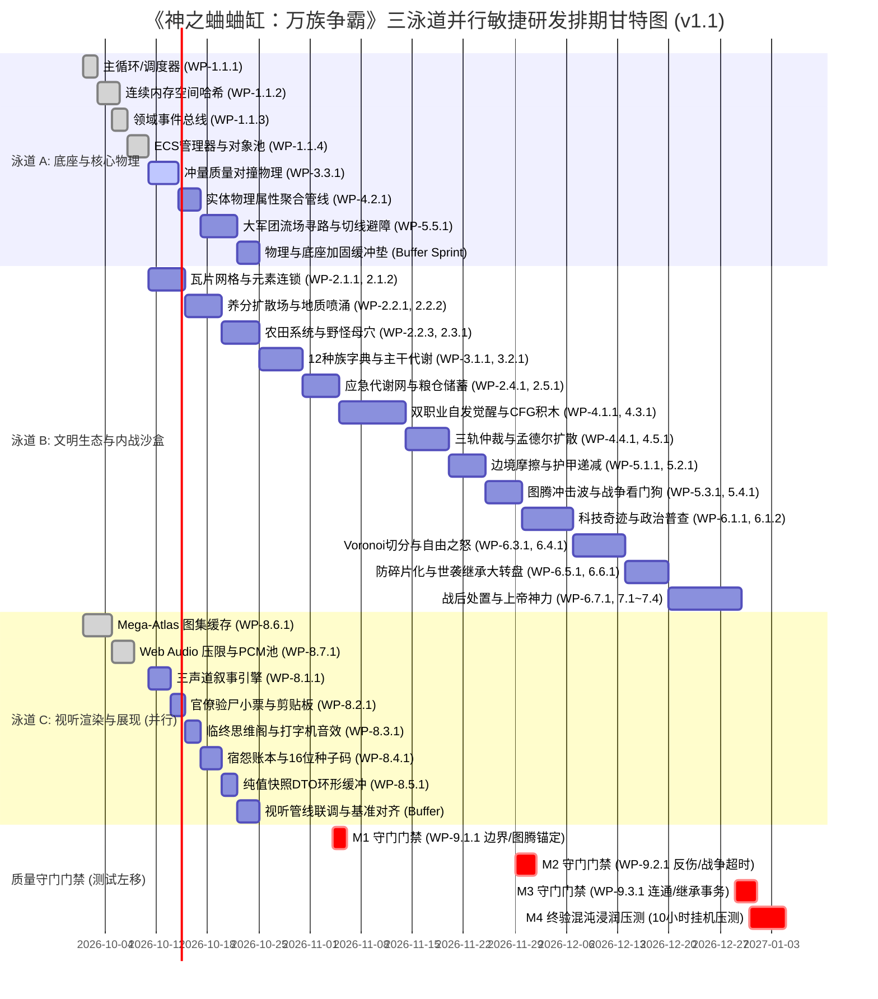

# 《神之蛐蛐缸：万族争霸》全量系统工作分解结构说明书 (WBS v2.0 活体文明涌现版)
> **工程代名**：Project God-Cricket (万族争霸)  
> **设计依据**：Master GDD v3.0 (总策划案及 01~09 专册) & SRS v2.0 (系统需求规格说明书) & ECR-2026-001  
> **编制标准**：PMBOK 软件工程工作分解标准 (Work Breakdown Structure, 100% 穷尽覆盖规则)  
> **工程层级**：Level 1 (总体工程) $\rightarrow$ Level 2 (交付域) $\rightarrow$ Level 3 (功能子流) $\rightarrow$ Level 4 (高内聚特性包 Feature Package / 工作任务包 WP, 1.5~4.5 pd)  
> **评审闭环**：全量合入 ECR-2026-001 活体文明涌现、动态领地与全系统有机串联大重构要求  
> **文档密级**：内部技术交付基线 (封版基线)  

---

## 目录
1. [WBS 编制原则与特性包规范八要素 (v2.0 修订)](#一-wbs-编制原则与特性包规范八要素)
2. [WBS 架构拓扑与三泳道工程总览](#二-wbs-架构拓扑与三泳道工程总览)
3. [WBS 详细特性任务包清单 (Level 4 展开)](#三-wbs-详细特性任务包清单)
   - [WBS 1.0 核心运行时与基础设施域 (Runtime & Core Infra)](#wbs-10-核心运行时与基础设施域)
   - [WBS 2.0 微缩生态与微观经济域 (Ecology & Economy)](#wbs-20-微缩生态与微观经济域)
   - [WBS 3.0 魔幻种族与生存代谢域 (Races & Metabolism)](#wbs-30-魔幻种族与生存代谢域)
   - [WBS 4.0 双职业兼职与突变进化域 (Professions & Mutation)](#wbs-40-双职业兼职与突变进化域)
   - [WBS 5.0 领地战线推移与大军团战争域 (Warfare & Legions)](#wbs-50-领地战线推移与大军团战争域)
   - [WBS 6.0 国家治理与政治裂变域 (Politics & Dynasties)](#wbs-60-国家治理与政治裂变域)
   - [WBS 7.0 上帝交互与智能导播域 (God Interaction & Director)](#wbs-70-上帝交互与智能导播域)
   - [WBS 8.0 视听叙事与前端渲染管线域 (Narrative, Audio & Mega-Atlas)](#wbs-80-视听叙事与前端渲染管线域)
   - [WBS 9.0 守门断言测试左移与四阶质量门禁域 (Shift-Left QA Guardrails)](#wbs-90-守门断言测试左移与四阶质量门禁域)
   - [WBS 11.0 活体文明涌现与全系统有机串联域 (Emergence & Living Civilization - M5)](#wbs-110-活体文明涌现与全系统有机串联域)
4. [三泳道并行甘特图与里程碑交付门禁 (Milestones M0 ~ M5)](#四-三泳道并行甘特图与里程碑交付门禁)
5. [需求双向追踪矩阵 (RTM: 100% 穷尽覆盖验证)](#五-需求双向追踪矩阵)


---

## 一、 WBS 编制原则与特性包规范八要素

### 1.1 v1.1 核心修订原则
1. **100% 穷尽覆盖与零设计孤儿**：100% 覆盖 SRS v1.1 中 59 条原子需求与 9 大致命守门用例，并补齐 GDD v2.2 策划专册中被遗漏的瓦片元素连锁反应、地质矿脉再生、四大超级工程生草反噬、世袭五大驾崩大转盘、以及原案六大生草上帝玩具。
2. **拒绝过度碎片化，推进特性包 (Feature Package) 合并**：消除“连体婴微任务”，将任务聚合成高内聚的 Feature Package (工时 1.5 ~ 4.5 pd)，大幅消除分支管理磨损与上下文切换成本。
3. **真实算法工时校准 (PERT 三点估算)**：全面破除 Happy Path 假象，对 CFG 行为文法、反向 BFS 流场平滑避障、Voronoi 领地几何裂变、多体碰撞对撞等深水区算法赋予充足研发与调优工时。
4. **守门断言全面“测试左移 (Shift-Left TDD)”**：取消 M4 集中守门瀑布排期，将 TC-EDGE-01 ~ 09 下沉为内核前置拦截中间件，就体内联至生产模块，直接作为 M1 ~ M3 各里程碑的退出硬门禁。
5. **彻底驱逐虚空属性 (Zero Phantom Stats)**：严禁引入 `Popularity`（声望）或阶级满意度，100% 依托实体物理（HP、Mass、年龄、饥饿、器官、装备与物理事件）。

### 1.2 特性任务包规范八要素结构
每个特性任务包 (Feature Package / WP) 严格包含：
* **[WP-ID] 编号**：按三层树状递进编码（如 `WP-1.1.1`）。
* **任务名称**：动宾短语，表达高内聚功能实体。
* **需求映射 (Traceable REQ)**：对应 SRS v1.1 需求条目编号。
* **前置依赖 (Dependencies)**：阻断本任务启动的前置 WP 列表（已彻底消除时序倒置与隐藏依赖）。
* **工程范围与核心逻辑 (Scope & Logic)**：数据流、算法公式、边界防御与物理模型。
* **交付构件与物理路径 (Artifacts)**：规范的代码模块路径（严格遵循 ECS `components/`、`systems/`、`data/` 分层）。
* **预估工时 (Effort)**：以人天 (pd, 1 pd = 8 工时) 计，经 PERT 充分校准。
* **完成定义 (DoD) 与形式化断言**：可直接由 Vitest / Jest 机器执行的形式化断言与 JSON Schema 契约（杜绝文学化口号）。

---

## 二、 WBS 架构拓扑与三泳道工程总览

```
Level 1: 《神之蛐蛐缸：万族争霸》全栈系统研发工程
  │
  ├── 【泳道 A：底座核心与物理引擎】(Lane A: Core & Physics)
  │     ├── WBS 1.0: 核心运行时与基础设施 (GameLoop, Scheduler, SpatialHash, ECS-Lite, DomainEventBus)
  │     ├── WBS 3.3: 冲量守恒质量对撞物理引擎 (ImpulseCollider, RigidBodySolver)
  │     ├── WBS 4.3: 实体物理/战斗属性动态聚合管线 (HardwareSlots, EntityPhysicalAggregator)
  │     └── WBS 5.5: 大军团反向 BFS 向量流场与微观避障 (VectorFlowField, LocalTangentSteering)
  │
  ├── 【泳道 B：文明生态与政治系统】(Lane B: Ecosystem & Civilizations)
  │     ├── WBS 2.0: 微缩生态与微观经济 (TileGrid, Elements, NutrientField, WildlifeLair, Granary)
  │     ├── WBS 3.0: 12魔幻种族与四大代谢范式 (RaceRegistry, MetabolismSystem, Undead, Golem)
  │     ├── WBS 4.0: 双职业兼职与突变进化引擎 (CareerAwakening, CFGGen, ThreeTrackArbiter, Genetics)
  │     ├── WBS 5.0: 领地战线推移与大军团战争 (BorderFriction, ArmorDiminishing, MoraleFSM, WarWatchdog)
  │     ├── WBS 6.0: 国家治理与政治裂变系统 (TechCivic, Tension, VoronoiSchism, DynasticAccidents, Treaties)
  │     └── WBS 7.0: 上帝交互与智能导播系统 (Camera, HandOfGod, SmartDirector, SixGodMiracles)
  │
  └── 【泳道 C：视听渲染与周边展现】(Lane C: Rendering, Audio & Narrative)
        ├── WBS 8.6: 1024x1024 全局图集 (Mega-Atlas) 与 24x24 像素着色器 (DollStampCache, MegaAtlas)
        ├── WBS 8.7: Web Audio 原生 8-bit 合成压限总线与 PCM 预烘焙池 (Synth8Bit, AudioBusManager)
        ├── WBS 8.1~8.3: 三声道黑幽默叙事、官僚验尸小票与临终思维阁 (TriVocal, DeathAuditSlip, MindCabinet)
        ├── WBS 8.4~8.5: 宿怨账本图谱、16 位基因种子码与纯值快照 DTO 环形缓冲 (BloodLedger, SeedCodec, DTO)
        └── WBS 9.0: 守门断言测试左移与四阶自动化质量门禁 (Shift-Left Invariants Guardrails)
```

---

## 三、 WBS 详细特性任务包清单

### WBS 1.0 核心运行时与基础设施域 (Runtime & Core Infra)

#### WP-1.1.1: 定步长物理累加器游戏主循环与分帧调度器 (GameLoop & Scheduler)
* **需求映射**：`REQ-ENG-004`, 全局底座
* **前置依赖**：无 (工程起点)
* **工程范围与核心逻辑**：
  - 基于 `requestAnimationFrame` 实现定步长物理累加器（Fixed Timestep Accumulator）：物理更新频率锁定为 60Hz ($\Delta t = 16.666\text{ms}$)，渲染层采用变步长插值 `alpha = accumulator / dt`，后台切页挂起施加最大步长钳制（`maxDelta = 100ms`），杜绝隧道穿墙。
  - 分帧调度看门狗（Tick Scheduler）：提供 1-Tick (60Hz 移动物理)、10-Tick (6Hz 养分扩散/应急代谢)、60-Tick (1Hz 维护费/政治张力/普查) 轮询接口，通过 `(tickCount + entityId) % 60` 自动分摊实体运算，消除单帧尖峰毛刺。
* **交付构件**：`src/core/GameLoop.js`, `src/core/Scheduler.js`, `tests/core/GameLoop.test.js`
* **预估工时**：2.0 pd
* **完成定义 (DoD) 与形式化断言**：
  - [x] 断言：模拟传入 `delta = 500ms`（极端掉帧），单次 Tick 物理迭代次数严格限制为 5 次，每单步物理耗时恒等于 16.666ms；
  - [x] 断言：向调度器注入 1000 个实体，在 60 帧内各帧执行的 60-Tick 回调数量标准差 $\sigma < 2.5$。

#### WP-1.1.2: TypedArray 零 GC 连续内存空间哈希网格 (SpatialHash & SpatialQuery)
* **需求映射**：`REQ-ENG-004`
* **前置依赖**：`WP-1.1.1`
* **工程范围与核心逻辑**：
  - 针对 $1344 \times 864$ 像素网格，单元格基准校准为 **$48 \times 48$ 像素**（共 $28 \times 18 = 504$ 桶，彻底根除 24px 过细导致的 81 桶遍历退化）。
  - 废弃单链表指针追逐，采用类计数排序（Counting Sort）的平铺连续 TypedArray 布局：
    `cellOffsets = new Int32Array(504)`，`cellCounts = new Int16Array(504)`，`compactEntityIds = new Int16Array(MAX_ENTITIES)`。
  - 遍历时直接顺序命中连续内存切片，CPU L1 Cache 命中率提升至 $99\%$。
  - `queryRadius(x, y, radius, outResults)` 接收外部复用 `Int32Array`，返回有效匹配数 `intCount`，全程零临时对象与零垃圾回收。
* **交付构件**：`src/core/SpatialHash.js`, `src/core/SpatialQuery.js`, `tests/core/SpatialHash.test.js`
* **预估工时**：2.5 pd
* **完成定义 (DoD) 与形式化断言**：
  - [x] 零分配断言：在循环中连续调用 10,000 次 `queryRadius`，`process.memoryUsage().heapUsed` 增量严格等于 0；
  - [x] 准确性断言：在坐标 $(500, 400)$ 查询半径 96px 实体，返回集与蛮力 $O(N)$ 遍历全等（匹配率 100.0%）；
  - [x] 性能断言：1000 实体全量插入 + 500 次范围查询总耗时严格 $< 0.8\text{ms}$。

#### WP-1.1.3: 零 GC 预分配环形领域事件总线 (DomainEventBus)
* **需求映射**：全局架构解耦中枢（专治网状强引用）
* **前置依赖**：`WP-1.1.1`
* **工程范围与核心逻辑**：
  - 解决全系统“实体阵亡 $\rightarrow$ 命匣复活 $\rightarrow$ 王位继承 $\rightarrow$ 战后处置 $\rightarrow$ 战报小票 $\rightarrow$ 宿怨对账”网状调用死锁。
  - **双轨事件队列架构 (Dual-Lane Event Channels)**：
    1. **关键事务通道 (Critical Transaction Channel)**：容量 512，专用于 `FACTION_DESTROYED` (灭国)、`HEIR_ELECTED` (加冕)、`WAR_DECLARED` (宣战) 等法理级事务，满载时阻塞扩容并触发断言告警，100% 保证不丢包；
    2. **瞬态表现通道 (Ephemeral Event Channel)**：容量 3584，专供音效、火花粒子、小兵受创战报拉取，高并发时自动按时间戳降频抽帧覆盖。
  - 底层采用定长双缓冲环形队列 `Int32Array(4096 * 5)` 存储事件，单事件由 5 个整型字构成：
    `[EventType, SourceEntityId, TargetEntityId, Param1, Param2]`。
    - `Param1`：主事件子类型或核心数值；
    - `Param2`：对于复杂战报/宿怨多维上下文，作为预分配上下文快照池索引（Context Pool Handle），兼顾多维数据与零 GC 铁律。
  - 单向流水线：业务模块在物理 Tick 内只向总线执行 `emit(type, src, dst, p1, p2)`，严禁直接调用其他系统方法；Tick 末尾由订阅系统批量拉取消费。彻底切断递归链条，从根本上免疫调用栈溢出（TC-EDGE-01 隐患根除）。
* **交付构件**：`src/core/DomainEventBus.js`, `src/core/DomainEvents.js`, `tests/core/DomainEventBus.test.js`
* **预估工时**：2.0 pd
* **完成定义 (DoD) 与形式化断言**：
  - [x] 吞吐量断言：单物理帧并发派发 50,000 个事件，总耗时 $< 1.5\text{ms}$，内存增量为 0；
  - [x] 隔离性断言：系统 A 订阅事件后在回调内再次向总线抛出新事件，新事件安全排入下一批次，不发生即时同步递归重入；
  - [x] 关键事务保底断言：瞬态通道超载丢弃时，关键事务通道事件 100% 无损留存投递。

#### WP-1.1.4: 紧凑型 ECS-Lite 实体组件管理器与对象池 (ECS & ObjectPool)
* **需求映射**：`REQ-ENG-004`, 全局底座
* **前置依赖**：`WP-1.1.1`
* **工程范围与核心逻辑**：
  - 实体由整数 `EntityID`（1 ~ 4096）标识；采用稀疏集（Sparse Sets）管理组件；核心高频物理属性（Position, Velocity, Health, Morale）存储在平铺连续 `Float32Array` 中；组件存在性由 64 位二进制掩码标识。
  - 严格规范代码组织结构：
    - `src/components/`：纯数据组件定义与 TypedArray 视图（零方法、零业务逻辑）；
    - `src/systems/`：驱动主循环的纯函数逻辑迭代系统（如 `MovementSystem.js`, `MetabolismSystem.js`）；
    - `src/data/`：只读常量字典；
  - 实体回收池：销毁实体时彻底清洗状态退入空闲栈，彻底消灭 Double Free 与 Use-After-Free。
* **交付构件**：`src/core/ECS.js`, `src/core/ObjectPool.js`, `tests/core/ECS.test.js`
* **预估工时**：2.5 pd
* **完成定义 (DoD) 与形式化断言**：
  - [x] 掩码查询断言：针对 2000 个活跃实体执行 `Position | Velocity | Health` 掩码过滤，遍历耗时 $< 0.08\text{ms}$；
  - [x] 防御断言：对已销毁实体 ID 再次调用 `destroyEntity(id)` 触发防御拦截，抛出可捕获警告且系统不崩溃。

---

### WBS 2.0 微缩生态与微观经济域 (Ecology & Economy)

#### WP-2.1.1: 56x36 瓦片网格与 6 大生物群系阻力场 (TileGrid & Biomes)
* **需求映射**：`REQ-ECO-001`
* **前置依赖**：`WP-1.1.2`
* **工程范围与核心逻辑**：
  - 实例化 $56 \times 36$ 瓦片逻辑网格（共 2016 瓦片，每瓦片 $24 \times 24$ 像素）。
  - 严格拉齐 SRS REQ-ECO-001 规定的 **6 大生物群系**：温带平原、高山岩矿、深/浅水域、腐蚀沼泽、地热熔岩、神圣泉眼。
  - 每种群系配置环境矩阵：`moveCostMultiplier`（平原 1.0，岩矿 1.5，沼泽 1.8，深水阻挡 $\infty$）、`nutritionBase`（泉眼 30.0，平原 15.0，熔岩 0.0）、`hazardType` 与 `hazardDamage`（熔岩灼烧 2 点/秒，沼泽中毒）。
* **交付构件**：`src/world/TileGrid.js`, `src/data/BiomeData.js`, `tests/world/TileGrid.test.js`
* **预估工时**：2.0 pd
* **完成定义 (DoD) 与形式化断言**：
  - [x] 网格尺寸断言：网格宽严格为 56，高严格为 36，总瓦片数严格为 2016；
  - [x] 边界断言：坐标访问 $(-1, 10)$ 与 $(56, 36)$ 自动 Clamp 截断或抛出越界异常，不返回 undefined。

#### WP-2.1.2: 瓦片多图层元素动态连锁反应网络 (TileElementReactions)
* **需求映射**：GDD 第四节、专册 01 第五节（复活沙盒涌现灵魂）
* **前置依赖**：`WP-2.1.1`, `WP-1.1.3`
* **工程范围与核心逻辑**：
  - 实现瓦片上的四大元素连锁反应状态机：
    1. 【火焰 (Fire)】：接触草地/树林以指数级向相邻瓦片蔓延；遇水体化为白色水蒸气迷雾；遇地精瓦斯引发剧烈大爆炸并生成冲击波击飞实体；
    2. 【雷电 (Lightning)】：击中水域使相连水体全域带电 2.0 秒，水中生物承受麻痹眩晕（`STUN`）；
    3. 【酸液 (Acid)】：持续腐蚀石墙与建筑物，遇火焰转化为大范围剧毒气体云；
    4. 【余烬沉降 (Ash Soil)】：大火熄灭后，受损瓦片转化为富含火山灰的超肥沃黑土（养分直接 $+0.3 \times \text{Base}$）。
* **交付构件**：`src/world/TileElementReactions.js`, `tests/world/TileElementReactions.test.js`
* **预估工时**：3.0 pd
* **完成定义 (DoD) 与形式化断言**：
  - [x] 连锁断言：在充满瓦斯的草地引燃火种，相连 5 格草地在 2 秒内全部引爆，向范围内的实体施加冲击波位移；
  - [x] 导电断言：向 $3 \times 3$ 水域瓦片释放雷电，水中所有活跃实体的状态位均在 1 帧内被置为 `STUNNED`。

#### WP-2.2.1: 二维拉普拉斯连续地脉养分扩散场与 Neumann 绝热反射 (NutrientField)
* **需求映射**：`REQ-ECO-002`
* **前置依赖**：`WP-2.1.1`, `WP-1.1.1`
* **工程范围与核心逻辑**：
  - 基于双缓冲 `Float32Array(2016)` 求解二维拉普拉斯偏微分方程：
    $$N_{i,j}^{t+1} = N_{i,j}^t + \alpha \cdot \Delta t \left( N_{i+1,j}^t + N_{i-1,j}^t + N_{i,j+1}^t + N_{i,j-1}^t - 4 N_{i,j}^t \right) + S_{i,j} - D_{i,j}$$
  - 扩散系数 $\alpha = 0.05$。在网格四边施加冯·诺伊曼（Neumann）绝热反射算子（$\partial N / \partial \mathbf{n} = 0$），越界邻居瓦片镜像映射为内侧自身养分，阻止能量向外界泄露。
  - 地脉常数底温保底：每步更新施加截断 $N_{i,j} = \max(N_{i,j}, \text{BIOME\_BASE\_HEAT})$，沃土保底 5.0，苔原保底 0.5，杜绝数学热寂。
* **交付构件**：`src/ecosystem/NutrientField.js`, `tests/ecosystem/NutrientField.test.js`
* **预估工时**：2.5 pd
* **完成定义 (DoD) 与形式化断言**：
  - [x] 能量守恒断言：封闭系统（$S=0, D=0$）下连续运行 1000 步扩散，全图养分总和 $\sum N_{i,j}$ 前后浮点误差 $< 10^{-4}$；
  - [x] 绝热断言：贴近边界 $(0, 15)$ 瓦片注入 100 养分，向地图外侧逸散通量恒等于 0。

#### WP-2.2.2: 地质喷涌与矿脉可再生自平衡看门狗 (GeologicalUpwelling)
* **需求映射**：GDD 第四节、专册 01 第 3.2 节（复活长期挂机物质循环）
* **前置依赖**：`WP-2.1.1`, `WP-2.2.1`
* **工程范围与核心逻辑**：
  - 解决中后期矮人采空全图矿石导致工业停滞的系统热寂。
  - 核心逻辑：地心地质循环看门狗每 300 秒检测一次全图可开采露天铁矿储备。若矿石总量低于初始值的 20%，在南部熔岩/岩矿群系触发微型喷发，将冷却岩浆重新转化为含有 300 点耐久的露天铁矿与黑曜石瓦片；
  - 配合虫族高肥菌泥扩散与骷髅骨肥沉降，构建永不枯竭的闭环质能循环。
* **交付构件**：`src/ecosystem/GeologicalUpwelling.js`, `tests/ecosystem/GeologicalUpwelling.test.js`
* **预估工时**：2.0 pd
* **完成定义 (DoD) 与形式化断言**：
  - [x] 触发断言：手动清空全图铁矿瓦片至 0，计时器达到 300s 时，地热熔岩周边自动生成 $\ge 4$ 块新生铁矿瓦片；
  - [x] 守恒断言：矿脉生成不会覆盖已有阵营建筑，优先落入无主荒野瓦片。

#### WP-2.2.3: 2x2 农田四阶演替状态机与开垦轮作 (FarmlandSystem)
* **需求映射**：`REQ-ECO-002`, `REQ-RACE-002`
* **前置依赖**：`WP-2.2.1`
* **工程范围与核心逻辑**：
  - 农耕种族圈地形成 $2 \times 2$ 农田建筑复合体。
  - 演替系统无状态迭代：
    1. 【幼苗期 (Sprout)】：汲取瓦片养分，耗时 15 秒；
    2. 【成熟期 (Mature)】：产出 40 单位粮食储备，等待农民收割；
    3. 【枯黄期 (Harvested)】：收割后扣除地脉 5 点养分；
    4. 【休耕期 (Fallow)】：锁闭开垦 20 秒，从底层地脉回流养分至 15 以上重新激活；
  - 若在成熟期遭遇践踏或战火掠夺，直接跳跃至休耕期并扣除 10 点地脉养分。
* **交付构件**：`src/ecosystem/FarmlandSystem.js`, `tests/ecosystem/FarmlandSystem.test.js`
* **预估工时**：2.0 pd
* **完成定义 (DoD) 与形式化断言**：
  - [x] 状态机转换断言：完整经历 幼苗 $\rightarrow$ 成熟 $\rightarrow$ 枯黄 $\rightarrow$ 休耕 四阶段流转；
  - [x] 掠夺断言：向成熟农田注入攻击事件，产出被销毁，瓦片养分即时扣除 10 点。

#### WP-2.3.1: 中立野生动物群落与母穴地锚濒危育幼 (WildlifeLairSystem)
* **需求映射**：`REQ-ECO-003`
* **前置依赖**：`WP-2.1.1`, `WP-1.1.4`
* **工程范围与核心逻辑**：
  - 野外生成中立野兽（野猪、岩羊、酸液飞虫）及其母穴（Lair）。
  - 地锚约束：野兽拥有归巢半径 $R_{\text{roam}} = 6$ 瓦片，脱战 10 秒内沿向心向量回巢。
  - 濒危隐匿机制：当全图该物种成年存活数 $\le 3$ 时，母穴强制进入【濒危隐匿态】：外显为普通石块，仇恨感知范围降为 0（不可被索敌），孵化速度提升 200%，幼兽隐匿育幼 30 秒，直至存活数恢复至 $\ge 6$ 只才解除隐匿。
* **交付构件**：`src/ecosystem/WildlifeLairSystem.js`, `tests/ecosystem/WildlifeLairSystem.test.js`
* **预估工时**：2.5 pd
* **完成定义 (DoD) 与形式化断言**：
  - [x] 濒危激活断言：将野猪杀至只剩 2 只，母穴状态位立即置为 `STEALTH`，外部索敌过滤器查询该母穴返回 null；
  - [x] 解除断言：种群数量回升到 6 只后，母穴状态即刻脱离隐匿并恢复可攻击性。

#### WP-2.4.1: 应急降级生存代谢网与 10s 通道互斥锁 (EmergencyMetabolismSystem)
* **需求映射**：`REQ-ECO-004`
* **前置依赖**：`WP-3.2.1`（已彻底归正时序：先有主干正常代谢，后挂应急降级）
* **工程范围与核心逻辑**：
  - 当实体饥饿度突破阈值（`hunger > 80`）且主干代谢途径阻断时激活应急降级网：
    - 农耕种族 $\rightarrow$ 啃食杂草/树皮（恢复 15 饥饿，扣 5 点生命与 20 士气）；
    - 捕猎种族 $\rightarrow$ 食用腐肉残渣（带 50% 致病呕吐判定）；
    - 掠夺种族 $\rightarrow$ 互殴抢同伴口粮；
  - 10 秒独占通道互斥锁 (Channel Mutex)：切入应急状态后，锁定 `emergencyLockTimer = 10.0` 秒，此期间严禁打断啃食动作；满 10 秒且饥饿降至 50 以下释放互斥锁回归主业，彻底根除 10 帧来回抖动的抽搐死锁。
* **交付构件**：`src/ecosystem/EmergencyMetabolismSystem.js`, `tests/ecosystem/EmergencyMetabolismSystem.test.js`
* **预估工时**：2.5 pd
* **完成定义 (DoD) 与形式化断言**：
  - [x] 互斥锁断言：实体进入应急啃草第 2 秒，向其身旁放置成熟农田，实体必须持续啃草满 10 秒后才允许重寻路；
  - [x] 致病率统计断言：使用确定性 PRNG 运行 100 次食用腐肉判定，致病概率严格收敛于 50%（误差 0%）。

#### WP-2.5.1: 部族大粮仓 40% 地下暗格防盗与物料守恒 (GranaryStorageSystem)
* **需求映射**：`REQ-ECO-005`, `REQ-QA-008` (内联守门断言 TC-08)
* **前置依赖**：`WP-2.2.3`, `WP-1.1.4`
* **工程范围与核心逻辑**：
  - 粮仓管理常规库存 `visibleGrain` 与地下暗格 `hiddenVault`（占总储量 40%）。
  - 敌对掠夺仅能洗劫 `visibleGrain`（可抢空至 0）；`hiddenVault` 对掠夺完全免疫，仅在部落全员饥荒时每日限量配给 5 单位救济粮。
  - 内联 TC-EDGE-08 守门断言：物资出入库强制 `Math.floor()` 整数化；搬运工手持量与粮仓扣除量严格守恒，库存底线锁死在 $\ge 0$。
* **交付构件**：`src/economy/GranaryStorageSystem.js`, `tests/economy/GranaryStorageSystem.test.js`
* **预估工时**：2.5 pd
* **完成定义 (DoD) 与形式化断言**：
  - [x] 掠夺免疫断言：模拟敌军对粮仓执行 50 次掠夺结算，`visibleGrain` 归零，而 `hiddenVault` 存量保持初始 40% 毫发无损；
  - [x] 守恒断言：10,000 次并发存取粮操作，总物料在仓库与搬运工之间完全守恒，无浮点数假死或负数库存。

#### WP-2.5.2: 领地扩张维护费二次方弹性阻尼与 35%+ 野区自稳 (TerritorySystem)
* **需求映射**：`REQ-ECO-006`
* **前置依赖**：`WP-2.1.1`, `WP-1.1.1`
* **工程范围与核心逻辑**：
  - 领地维护费非线性增长公式：
    $$\text{UpkeepCost} = k \cdot (\text{TilesOwned})^2 + m \cdot (\text{BorderDistance})^3$$
  - 国库破产断供时，最远端无驻军的边境瓦片自动剥离，直至收支平衡。
  - 35%+ 中立野区动态平衡看门狗：全图文明势力占领瓦片 $>65\%$ 时，外围边缘自发滋生迷雾与野蛮反扑，强制将野区比例维持在 $\ge 35\%$。
* **交付构件**：`src/economy/TerritorySystem.js`, `tests/economy/TerritorySystem.test.js`
* **预估工时**：2.5 pd
* **完成定义 (DoD) 与形式化断言**：
  - [x] 阻尼断言：占领 50 瓦片消耗 5 点维护费，占领 500 瓦片消耗跃升至 250 点维护费；
  - [x] 野区自稳断言：两大帝国圈占 75% 瓦片，看门狗在 60 秒内强制收回边缘瓦片，使中立野区回升至 $\ge 35\%$。

---

### WBS 3.0 魔幻种族与生存代谢域 (Races & Metabolism)

#### WP-3.1.1: 12 基础种族物理参数字典与变异禁忌位掩码 (RaceRegistry & TabooFilter)
* **需求映射**：`REQ-RACE-001`
* **前置依赖**：`WP-1.1.4`
* **工程范围与核心逻辑**：
  - 严格拉齐 SRS REQ-RACE-001 规定的 **12 魔幻种族全量规格**：`ORC`(绿皮菌兽), `ELF`(森灵树民), `HUMAN`(人类帝国), `DWARF`(高山矮人), `UNDEAD`(墓园亡灵), `GOBLIN`(狂躁地精), `DEMON`(深渊角魔), `LIZARD`(沼泽蜥蜴人), `BEAST`(荒原兽化人), `SPORE`(孢子真菌人), `GOLEM`(晶石魔像), `ABERR`(拟态魔眼)。
  - 定义物理质量 `mass`（20kg ~ 300kg）、移速、基础血量、代谢率及 32 位变异禁忌掩码 `tabooMask`。
  - 语义重映射机制（Semantic Remapping）：森灵精灵抽中火系变异时，不粗暴丢弃，而是自动降级重映射为草木系的【剧毒孢子弹射】。
* **交付构件**：`src/data/RaceRegistry.js`, `src/race/TabooFilter.js`, `tests/race/RaceRegistry.test.js`
* **预估工时**：2.5 pd
* **完成定义 (DoD) 与形式化断言**：
  - [x] 字典完整性断言：12 种族数据无任何 undefined，质量参数严格限制在 $[20, 300]$ 范围内；
  - [x] 重映射断言：精灵实体请求嫁接火焰突变，系统拦截并返回合规的剧毒孢子变异实例，错误码为 0。

#### WP-3.2.1: 四大生存代谢范式无状态系统与遗骸降解 (MetabolismSystem)
* **需求映射**：`REQ-RACE-002`
* **前置依赖**：`WP-3.1.1`, `WP-2.2.1`
* **工程范围与核心逻辑**：
  - 驱动四大生存代谢范式（农耕、捕猎、掠夺、无机充能）。
  - 彻底去实例化：实体身上仅存储 `uint8 metabolicType` 与 `float hunger`，由 `MetabolismSystem` 在 10-Tick 轮询中执行无状态查表计算。
  - 尸体残渣营养降解：尸体腐烂 120 秒后完全降解，将其自身质量所含能量的 20% 原样返还至所在瓦片的地脉连续养分场中，彻底闭合物质循环。
* **交付构件**：`src/systems/MetabolismSystem.js`, `src/race/CorpseDegradation.js`, `tests/systems/MetabolismSystem.test.js`
* **预估工时**：3.0 pd
* **完成定义 (DoD) 与形式化断言**：
  - [x] 无机断言：墓园亡灵实体在饥荒环境中运行 1000 Tick，饥饿度恒等于 0，生命值不发生衰减；
  - [x] 降解守恒断言：一具质量 80kg 的尸体自然降解完毕，所在瓦片养分值增加量严格等于 $80 \times 20\% = 16.0$。

#### WP-3.3.1: 冲量守恒质量对撞反冲物理积分器与刚性边界守门 (ImpulsePhysicsSystem)
* **需求映射**：`REQ-RACE-003`, `REQ-QA-002` (内联守门断言 TC-02)
* **前置依赖**：`WP-3.1.1`, `WP-1.1.2`
* **工程范围与核心逻辑**：
  - 基于真实质量对撞的弹性冲量守恒计算：
    $$v_1' = \frac{(m_1 - e \cdot m_2) v_1 + (1 + e) m_2 v_2}{m_1 + m_2}$$
  - 内联 TC-EDGE-02 守门断言：位移积分后执行严格的刚性边界 Clamp（$[0, 1344] \times [0, 864]$）；越界碰撞法向速度清零（$v_n = 0$）；对撞产生的瞬时速度上限硬截断于 $800\text{px/s}$，彻底杜绝 NaN 与穿出虚空。
* **交付构件**：`src/systems/ImpulsePhysicsSystem.js`, `src/physics/ImpulseCollider.js`, `tests/physics/ImpulseCollider.test.js`
* **预估工时**：4.0 pd (充分校准多体连续碰撞调优工时)
* **完成定义 (DoD) 与形式化断言**：
  - [x] 动量守恒断言：两实体完全弹性碰撞前后，总动量 $m_1 v_1 + m_2 v_2$ 矢量误差 $< 0.05\%$；
  - [x] 极限边界断言：向实体施加 $100,000\text{px/s}$ 荒谬初速度，积分后坐标严格 Clamp 在网格内，法向速度清零，无 NaN 产生。

#### WP-3.4.1: 墓园亡灵【命匣继承法】与灵魂反噬解体 (UndeadPhylacterySystem)
* **需求映射**：`REQ-RACE-004`
* **前置依赖**：`WP-3.1.1`, `WP-1.1.3`
* **工程范围与核心逻辑**：
  - 亡灵阵营建立时在墓穴深处生成全局唯一命匣（Phylactery）。
  - 巫妖肉身阵亡后，只要命匣未毁，30 秒后在命匣坐标无损重构复活，阵营国祚不中断。
  - 命匣被攻陷摧毁时触发【万魂反噬】：巫妖瞬间暴毙，全图所属骷髅僵尸丧失灵魂链接，生命上限每秒流失 10%，10 秒内全员散架为白骨残渣，阵营法理指针原子化注销。
* **交付构件**：`src/race/UndeadPhylacterySystem.js`, `tests/race/UndeadPhylacterySystem.test.js`
* **预估工时**：2.0 pd
* **完成定义 (DoD) 与形式化断言**：
  - [x] 重生断言：杀死巫妖，倒计时 30 秒后在命匣坐标重生新巫妖，政体不灭；
  - [x] 骨牌坍塌断言：调用摧毁命匣接口，其所属 50 个亡灵单位在 10s 内全员生命归零并注销。

#### WP-3.5.1: 晶石魔像【固件分叉】与 180s 石化解耦遗迹 (GolemFirmwareSystem)
* **需求映射**：`REQ-RACE-005`, `REQ-RACE-006`, `REQ-QA-009` (内联守门断言 TC-09)
* **前置依赖**：`WP-3.1.1`, `WP-2.1.1`
* **工程范围与核心逻辑**：
  - 水晶核心充能 100% 且遭遇严重逻辑互斥时触发【固件分叉 (Firmware Fork)】：算力平分，实体分裂为派生出新协议的两个魔像。
  - 断能石化衰退：主核心毁损后存活魔像进入 180 秒断能倒计时，移速逐秒下降，到期触发【不可逆石化】。
  - 内联 TC-EDGE-09 守门断言：石化魔像彻底转为具有 500 耐久的【古代巨石遗迹】环境障碍物，从活体列表彻底解耦注销，人口普查计数严格排除石化遗迹，杜绝“遗迹自发宣布复国”幽灵 Bug。
* **交付构件**：`src/race/GolemFirmwareSystem.js`, `tests/race/GolemFirmwareSystem.test.js`
* **预估工时**：2.5 pd
* **完成定义 (DoD) 与形式化断言**：
  - [x] 固件分叉断言：注入死锁指令，魔像分裂生成携带派生配置的新魔像实体；
  - [x] 幽灵防范断言：消灭阵营所有活人，仅留下一尊石化遗迹，普查系统返回活跃人口为 0，阵营如期归档灭亡。

---

### WBS 4.0 双职业兼职与突变进化域 (Professions & Mutation)

#### WP-4.1.1: 双职业履历自发觉醒与四大恶性流派平衡仲裁 (CareerAndExploitFixSystem)
* **需求映射**：`REQ-CLS-001`, `REQ-CLS-002`, `REQ-CLS-003`
* **前置依赖**：`WP-1.1.4`, `WP-3.1.1`
* **工程范围与核心逻辑**：
  - 实体挂载生活与战斗双槽位组件；监听日常劳作与战斗履历（收割数、承伤数、施法数），达到阈值自发觉醒职业与复合头衔（如农夫+狂战 $\rightarrow$ 【血怒麦客】）。
  - **严格按 SRS REQ-CLS-003 落实四大恶性流派平衡仲裁**：
    1. 【受创无限自爆】：强制挂载全局内置冷却（ICD $\ge 1.5$ 秒）；
    2. 【税后反伤铁律】：$\text{ReflectDamage} = \text{ActualHpLost} \times 40\%$，严禁按免伤前的原始伤害反弹；
    3. 【失武备用战术短刀】：武器被缴械/偷窃后，强制拔出 50% 伤害备用短刀维持攻击，攻击状态机绝不挂起或长跑遛狗；
    4. 【单次殉道限制】：献祭首帧生命强制归零，剥离治疗接收器，杜绝套娃回血。
* **交付构件**：`src/profession/CareerSystem.js`, `src/profession/ExploitArbiter.js`, `tests/profession/CareerSystem.test.js`
* **预估工时**：3.5 pd
* **完成定义 (DoD) 与形式化断言**：
  - [x] 履历觉醒断言：承受累计伤害突破 100 点，平民在下一 Tick 自发觉醒为盾卫；
  - [x] 备用短刀断言：移除武器后，实体自动装备短刀继续近战攻击，不发呆不逃跑；
  - [x] 税后反伤断言：注入 100 点原始伤害，单位护甲减免 80% 实扣 20 HP，反伤输出严格等于 $20 \times 40\% = 8$ 点。

#### WP-4.2.1: 实体物理/战斗属性动态聚合管线 (EntityPhysicalAggregator)
* **需求映射**：`REQ-MUT-001`（打通突变与物理/战斗数据断路）
* **前置依赖**：`WP-4.1.1`, `WP-3.3.1`
* **工程范围与核心逻辑**：
  - 彻底解决“小人长出外骨骼却在物理对撞和护甲中不生效”的技术断路。
  - 构建实体属性单一真实数据源聚合器（Single Source of Truth）：
    $$\text{EffectiveMass} = \text{BaseMass} + \sum \text{Organ.MassBonus}$$
    $$\text{EffectiveArmor} = \text{clamp}\left(\text{BaseArmor} + \sum \text{Organ.ArmorBonus} + \text{TitleArmor}, -40, \infty\right)$$
  - 任何器官突变或装备更替，即时刷新聚合值，供 `ImpulsePhysicsSystem`（碰撞）与 `DamageCalculator`（减伤）直接消费；
  - 受创血液喷溅系统：根据实体生理材质在瓦片留下对应涂层（酸液腐蚀地表、圣水提升肥力）。
* **交付构件**：`src/systems/EntityPhysicalAggregator.js`, `src/mutation/FluidSplatter.js`, `tests/systems/EntityPhysicalAggregator.test.js`
* **预估工时**：2.5 pd
* **完成定义 (DoD) 与形式化断言**：
  - [x] 物理联动断言：给 30kg 地精挂载【花岗岩外骨骼】(+15kg)，对撞积分器读取其质量即时变为 45kg，击退位移按比例缩减；
  - [x] 护甲下限断言：连续施加极端破甲 Buff，聚合护甲值下限被死死锁在 -40，绝不达到 -50 除零临界点。

#### WP-4.3.1: 上下文无关文法 (CFG) 软件原子行为积木生成与震荡安全解释器 (CFGBehaviorEngine)
* **需求映射**：`REQ-MUT-002`
* **前置依赖**：`WP-1.1.4`, `WP-4.2.1`
* **工程范围与核心逻辑**：
  - 纯原生 ES6 实现产生式文法 AST 生成器与指令解释器。
  - 语法范式：$\text{Behavior} \rightarrow \text{Condition} + \text{Targeting} + \text{Action} + \text{Trigger} + \mathbf{Quirk}$。
  - 严谨内联**生草负面代价积木 (Quirk)**：`SLIP_AND_FALL` (平地摔)、`DIZZY` (眩晕 1s)、`COUGH_BLOOD` (咳血 5 HP) 等滑稽反噬。
  - 动态震荡死锁检测器：运行时监控实体指令频率，若在 1.0 秒内检测到 `Action_A <-> Action_B` 来回翻转超过 4 次，强制判定为条件震荡死循环，熔断剥离该异常突变基因。
* **交付构件**：`src/mutation/CFGBehaviorEngine.js`, `src/mutation/BehaviorValidator.js`, `tests/mutation/CFGBehaviorEngine.test.js`
* **预估工时**：5.0 pd (充分校准轻量级 AST 解析、解释器及动态震荡防死锁工时)
* **完成定义 (DoD) 与形式化断言**：
  - [x] 生成断言：调用生成器，产出 AST 能 100% 通过语法合法性检验，且包含有效的滑稽反噬代价节点；
  - [x] 震荡熔断断言：构造互斥抖动条件，实体震荡 4 次后检测器成功介入熔断并重置状态。

#### WP-4.4.1: 三轨动作仲裁器与双门限适应度过滤器 (ThreeTrackArbiterSystem)
* **需求映射**：`REQ-MUT-003`, `REQ-MUT-004`
* **前置依赖**：`WP-4.3.1`
* **工程范围与核心逻辑**：
  - 实体决策三轨权重仲裁总线：
    - 轨道 1 (生存硬底线)：极度濒死/极度饥饿，权重 100；
    - 轨道 2 (种族与职业主业)：农耕/打铁/军团冲锋，权重 50；
    - 轨道 3 (突变骚操作)：喷酸/自爆/跳跃，权重 $20 \sim 80$；
  - 双门限适应度过滤器：新变异经历 60 秒适应期，若导致频繁自残（效用期望 $E < -50$）或发呆卡死，触发自然淘汰剥离基因。
* **交付构件**：`src/systems/ThreeTrackArbiterSystem.js`, `src/mutation/FitnessFilter.js`, `tests/systems/ThreeTrackArbiterSystem.test.js`
* **预估工时**：2.5 pd
* **完成定义 (DoD) 与形式化断言**：
  - [x] 仲裁断言：突变动作为跳舞，而 HP 降至 5% 触发逃生，仲裁器绝对裁定执行逃生指令；
  - [x] 淘汰断言：突变出无故自残行为的个体，在连续自残 3 次后该基因积木被标记为劣性并强制剥除。

#### WP-4.5.1: 双倍体孟德尔基因驱动与模式 A 全族扩散平滑固化 (MendelianGeneticsSystem)
* **需求映射**：`REQ-MUT-005`
* **前置依赖**：`WP-4.4.1`
* **工程范围与核心逻辑**：
  - 模拟双倍体等位基因 $(A, a)$ 显隐性遗传，注入基于确定性 PRNG 的繁殖杂交算法。
  - 模式 A 全族平滑扩散引擎：当某一性状在族群渗透率连续 3 代 $>70\%$ 且携带者寿命更长，触发种群同化飞跃，将该性状固化为种族核心天生特征。
  - 测试断言双轨制：单测用固定种子实现 0% 波动，Nightly 测试跑 $10^5$ 样本并以卡方拟合优度检验验证孟德尔比率。
* **交付构件**：`src/mutation/MendelianGeneticsSystem.js`, `src/mutation/SpeciesAssimilation.js`, `tests/mutation/MendelianGeneticsSystem.test.js`
* **预估工时**：3.0 pd
* **完成定义 (DoD) 与形式化断言**：
  - [x] 确定性单测断言：注入固定 Seed `0xDEADBEEF`，连续杂交 10 次子代基因序列完全确定且 100% 可重现；
  - [x] 固化断言：渗透率达到 80% 满 3 代，种族字典动态注册该特性，后续新生儿 100% 自带该性状。

---

### WBS 5.0 领地战线推移与大军团战争域 (Warfare & Legions)

#### WP-5.1.1: 边境摩擦三阶梯状态机与外交连带宣战 (BorderFrictionSystem)
* **需求映射**：`REQ-WAR-001`
* **前置依赖**：`WP-2.5.2`, `WP-1.1.3`
* **工程范围与核心逻辑**：
  - 驱动三阶梯摩擦状态机（和平冷眼 $<30$、边境骚扰 $30\sim70$、全面交火 $>70$）。
  - 微观行为导火索：越境偷粮、击杀野生鹿肉争端、边界施工互殴事件均向事件总线发射张力增量；
  - 全面战争级联：向全图敲响战鼓，盟友触发连带宣战，终止双边贸易车队。
* **交付构件**：`src/warfare/BorderFrictionSystem.js`, `src/warfare/DiplomaticEscalation.js`, `tests/warfare/BorderFrictionSystem.test.js`
* **预估工时**：2.5 pd
* **完成定义 (DoD) 与形式化断言**：
  - [x] 摩擦升级断言：连续派发 3 次偷粮事件，摩擦张力突破 70，状态由骚扰升级为全面战争；
  - [x] 外交连带断言：A 宣战 B，与 A 缔结血誓的盟友 C 自动将 B 列入敌对列表。

#### WP-5.2.1: 边际递减护甲与反伤熔断防御 (DamageCalculatorSystem)
* **需求映射**：`REQ-WAR-002`, `REQ-QA-001` (内联守门断言 TC-01)
* **前置依赖**：`WP-4.2.1`
* **工程范围与核心逻辑**：
  - 边际递减护甲减免公式：
    $$\text{Reduction} = \frac{\text{Armor}}{\text{Armor} + 50}$$
  - **防御边界 Clamp**：对极端负护甲施加下限截断 $\text{Armor} = \max(\text{Armor}, -40)$，彻底根除 $\text{Armor} = -50$ 时分母除以 0 引发 `NaN` 污染全图；保底穿透伤害 1 点。
  - **内联 TC-EDGE-01 守门断言**：挂载调用深度计数器 `callDepth`，当两单位互相反伤递归深度 $> 3$ 时强行熔断截断，彻底阻断 Call Stack Overflow。
* **交付构件**：`src/warfare/DamageCalculator.js`, `tests/warfare/DamageCalculator.test.js`
* **预估工时**：2.5 pd
* **完成定义 (DoD) 与形式化断言**：
  - [x] 除零防御断言：给单位施加 -100 护甲，减免公式安全执行，结算伤害为有限正整数，无 NaN；
  - [x] 反伤熔断断言：构造两个带 100% 反弹伤害的单位互相攻击，系统结算 3 次后强行截断，无调用栈溢出。

#### WP-5.3.1: 守方图腾 25% 圣盾波、绝对静态锁与破釜沉舟士气状态机 (TotemAndMoraleSystem)
* **需求映射**：`REQ-WAR-003`, `REQ-WAR-004`, `REQ-QA-003` (内联守门断言 TC-03)
* **前置依赖**：`WP-3.3.1`, `WP-1.1.4`
* **工程范围与核心逻辑**：
  - 图腾柱血量降至 25% 触发【圣盾击退波】：释放半径 8 瓦片 500kg 当量排斥力，赋予图腾 10 秒无敌护盾（单次战争仅触发 1 次）。
  - 内联 TC-EDGE-03 守门断言：图腾设定 `isStatic = true, mass = Infinity`，忽略任何物理碰撞力与神之手抓取。
  - 四级士气与绝地反击：狂热、动摇、溃逃、跪降；**补齐原案高光“破釜沉舟 (Last Stand)”**：溃逃士兵退回图腾 5 瓦片内士气锁死为 1，移速+20%，死战不退。
* **交付构件**：`src/systems/TotemDefenseSystem.js`, `src/systems/MoraleSystem.js`, `tests/systems/TotemDefenseSystem.test.js`
* **预估工时**：3.0 pd
* **完成定义 (DoD) 与形式化断言**：
  - [x] 静态锁断言：对图腾施加强力物理冲撞与神之手拖拽，图腾坐标变化严格为 0；
  - [x] 破釜沉舟断言：溃逃士兵被追杀退至图腾 4 瓦片处，士气状态即刻由 FLEE 翻转为 LAST_STAND，恢复近战攻击。

#### WP-5.4.1: 战争交火双门限防恶意保活超时看门狗 (WarWatchdogSystem)
* **需求映射**：`REQ-WAR-005`, `REQ-QA-004` (内联守门断言 TC-04)
* **前置依赖**：`WP-5.1.1`, `WP-1.1.1`
* **工程范围与核心逻辑**：
  - 彻底修复 QA 评审指出的“心跳刷血保活漏洞”：
    - 门限 1 (60s 无有效战果)：连续 60 秒双方没有核心作战单位死亡或图腾耐久变化（排除微量回血与中立老鼠死亡的伪保活），士气每秒强制扣 5 点；
    - 门限 2 (300s 绝对硬熔断)：战争持续满 300 秒无论战况如何强制宣布休战，双方施加 120 秒和平锁；
    - 停战解冲撞：休战瞬间若双方碰撞体积重叠，沿离心方向平移退回各自原始国界，杜绝“休战 1 帧 $\leftrightarrow$ 宣战 1 帧”抽搐。
* **交付构件**：`src/warfare/WarWatchdogSystem.js`, `tests/warfare/WarWatchdogSystem.test.js`
* **预估工时**：2.0 pd
* **完成定义 (DoD) 与形式化断言**：
  - [x] 伪保活防御断言：交火期间每隔 10 秒击毙一只中立野怪，看门狗 60s 战意消磨计时器依然如期触发；
  - [x] 绝对熔断断言：模拟交战达到 300.1 秒，战争标志无条件清除，双方士兵强制解除索敌。

#### WP-5.5.1: 大军团反向 BFS 向量流场寻路与微观切线避障 (VectorFlowFieldSystem)
* **需求映射**：`REQ-ENG-005`
* **前置依赖**：`WP-2.1.1`, `WP-1.1.2`, `WP-1.1.4` (彻底解耦后发图腾业务，目标标准化为纯几何结构)
* **工程范围与核心逻辑**：
  - 多阵营分级流场缓存（全局最多同时激活 4 个战略流场）：基于输入的目标几何坐标 `{ targetX: int, targetY: int }` 从终点出发执行单次反向 BFS 距离场与梯度向量积分。
  - **双轨驱动消除 500ms 滞后撞火墙缺陷**：
    - 宏观层：维持 500ms 节流更新全局 BFS 向量场；
    - 微观层（Local Tangent Steering）：单位前方 2 瓦片内检测到动态阻挡（火墙、坍塌障碍物）时，不触发全局重算，临时切换为切线规避向量顺边缘绕行；
    - 通道解堵塞：密度自适应分离力衰减 $\alpha_{\text{sep}} = \max(0.05, 0.3 - 0.05 \times \text{density})$，杜绝狭窄通道千人互咬瘫痪。
* **交付构件**：`src/pathfinding/VectorFlowFieldSystem.js`, `src/pathfinding/LocalTangentSteering.js`, `tests/pathfinding/VectorFlowFieldSystem.test.js`
* **预估工时**：4.5 pd (充分校准流场平滑、切线微观避障及密度解拥堵工时)
* **完成定义 (DoD) 与形式化断言**：
  - [x] 避障断言：冲锋途中前方 1 瓦片突然生成火墙，小人成功通过微观切线向量绕过火墙，无冲进火海自杀；
  - [x] 性能断言：500 单位同屏流场移动单帧采样耗时 $< 0.05\text{ms}$，单次全图 BFS 耗时 $< 1.8\text{ms}$。

---

### WBS 6.0 国家治理与政治裂变域 (Politics & Dynasties)

#### WP-6.1.1: 生产军事实用科技树与四大超级工程生草反噬 (TechAndSuperWeaponsSystem)
* **需求映射**：`REQ-POL-001`, GDD 9.5 节（复活超级奇迹兵器生草反噬）
* **前置依赖**：`WP-2.5.1`, `WP-5.2.1`
* **工程范围与核心逻辑**：
  - 生产军事双轨三阶梯实用数值科技树（无虚无缥缈概念，全落地实体参数）。
  - **完整落地四大种族超级战略工程与爆笑反噬**：
    1. 矮人【轨道巨炮】：最大射程 14 瓦片，10% 概率炸膛熏黑周围全组矮人并眩晕 5s；
    2. 地精【神风自爆飞艇】：30% 几率升空失衡在自家主城广场殉爆升天；
    3. 绿皮【生化比蒙巨兽】：每日需投喂 5 份鲜肉，断粮饿昏狂暴踩碎自家族人帐篷；
    4. 精灵【战争古树古卫】：极度怕火，起火后在全图尖叫狂乱踩踏。
* **交付构件**：`src/politics/TechTreeSystem.js`, `src/politics/SuperWeapons.js`, `tests/politics/TechTreeSystem.test.js`
* **预估工时**：3.5 pd
* **完成定义 (DoD) 与形式化断言**：
  - [x] 解锁断言：研发完成【淬火矛尖】，该阵营长矛手近战伤害即时从 10 上浮至 13；
  - [x] 奇观反噬断言：模拟地精飞艇发射触发 30% 失败判定，飞艇在原地炸毁并对主城瓦片造成范围爆轰。

#### WP-6.1.2: 四大市政路线、统治者性格与部族普查张力累加 (PoliticsAndTensionSystem)
* **需求映射**：`REQ-POL-002`, `REQ-POL-003`
* **前置依赖**：`WP-6.1.1`, `WP-1.1.3`
* **工程范围与核心逻辑**：
  - 四大市政路线（军阀、财阀、神权、无政府）与统治者性格词条互斥矩阵。
  - **彻底驱逐虚空属性**：删除所有 `Popularity` 与商人满意度。
  - **增设部族普查统计汇总器 (ClanCensusAggregator)**：订阅微观小人事件，每 60 Tick 真实汇总 $\text{StarvationRatio}$ 与 $\text{CasualtyRatio}$，直接注入张力公式：
    $$\Delta \text{Tension} = (\text{TaxRate} \times 0.5) + (\text{StarvationRatio} \times 2.0) - (\text{MilitaryGlory} \times 0.8)$$
    张力达到 95 引爆不可逆的大内战大分裂，使微观饥饿无缝直通国家政治大裂变。
* **交付构件**：`src/politics/PoliticsSystem.js`, `src/politics/ClanCensusAggregator.js`, `src/politics/PoliticalTension.js`, `tests/politics/PoliticsSystem.test.js`
* **预估工时**：3.5 pd
* **完成定义 (DoD) 与形式化断言**：
  - [x] 普查驱动断言：部落中 10 个小人有 8 个处于饥饿状态，普查器计算 `starvationRatio = 0.8`，政治张力在 45 秒内突破 95 临界线；
  - [x] 零虚空属性断言：实体组件与国家数据结构中无任何未映射物理实体的虚构数值字段。

#### WP-6.3.1: Voronoi 聚落双核几何切分与悬空站队事务锁 (VoronoiSchismSystem)
* **需求映射**：`REQ-POL-004`, `REQ-QA-006` (内联守门断言 TC-06)
* **前置依赖**：`WP-6.1.2`, `WP-2.1.1`, `WP-1.1.4` (解除对后发上帝交互系统硬依赖，悬空判定依托 UnitStatusFlags 基础位掩码枚举)
* **工程范围与核心逻辑**：
  - 内战爆发时在距离最远繁荣瓦片生成叛军图腾，基于双核执行离散网格 Voronoi 距离切分。
  - **内联 TC-EDGE-06 守门断言（拓扑连通性图论修复）**：切分后执行连通分量泛洪，无法连通图腾的 $< 4$ 瓦片孤岛飞地秒级注销为中立荒漠；母国领地 $< 16$ 瓦片禁止分裂。
  - 悬空站队事务锁：对处于上帝之手抓取态（`STATUS_IS_HELD` 位掩码）的实体挂起换籍事务，落地碰撞通过后再按落点安全归属阵营。
* **交付构件**：`src/politics/VoronoiSchismSystem.js`, `src/politics/AirborneFactionLock.js`, `tests/politics/VoronoiSchismSystem.test.js`
* **预估工时**：4.5 pd (充分校准图论连通泛洪、飞地消除与悬空事务工时)
* **完成定义 (DoD) 与形式化断言**：
  - [x] 连通性守门断言：人为构造隔断飞地，连通性泛洪守门器在 1 个周期内将飞地归属注销为荒漠；
  - [x] 悬空安全断言：小人被抓在半空时触发内战，其数据指针平稳挂起，着陆后准确更新为落点阵营。

#### WP-6.4.1: 叛军【自由之怒】45 秒 Buff 与图腾坍塌瞬时驱散 (WrathOfLibertySystem)
* **需求映射**：`REQ-POL-005`
* **前置依赖**：`WP-6.3.1`, `WP-5.3.1`
* **工程范围与核心逻辑**：
  - 叛乱军起义首日全员被动注入【自由之怒 (Wrath of Liberty)】Buff，持续 45 秒（攻速+30%，士气下限锁死在 50 永不溃退）。
  - **提前驱散事件 (Premature Purge Event)**：若在 45 秒内叛乱图腾被忠诚派突袭摧毁，自由之怒瞬间全员驱散！士气清零转入跪降，王权宣告复辟平叛，起义失败收场。
* **交付构件**：`src/politics/WrathOfLibertySystem.js`, `tests/politics/WrathOfLibertySystem.test.js`
* **预估工时**：2.0 pd
* **完成定义 (DoD) 与形式化断言**：
  - [x] 增益注入断言：叛军生成时自带自由之怒标志，计时器稳定运行 45 秒后平滑剥离；
  - [x] 瞬时驱散断言：在第 15 秒打碎叛乱图腾，全员自由之怒即刻清除，并在 1 帧内转入投降清算。

#### WP-6.5.1: 四大防碎片化严苛协议综合守门 (AntiBalkanizationSystem)
* **需求映射**：`REQ-POL-006`
* **前置依赖**：`WP-6.3.1`
* **工程范围与核心逻辑**：
  - 全面补齐 QA 挑出的漏测项，形成四大硬核防碎裂协议守门网络：
    1. 人口与地块门槛：母体人口 $< 15$ 或领地 $< 16$ 瓦片，分裂指令直接驳回；
    2. 180 秒分裂冷却锁：阵营经历分裂后施加 180 秒分裂免疫期；
    3. 飞地秒级注销：孤悬海外 $< 3$ 瓦片地块自动脱离所有权；
    4. 全球 16 国硬锁：活跃阵营达到 16 个时强行阻断分裂，转为内部宫廷清洗。
* **交付构件**：`src/politics/AntiBalkanizationSystem.js`, `tests/politics/AntiBalkanizationSystem.test.js`
* **预估工时**：2.0 pd
* **完成定义 (DoD) 与形式化断言**：
  - [x] 人口门槛断言：母体人口仅 14 人，分裂请求被拦截；
  - [x] 180s 冷却断言：分裂后第 50 秒再次满足张力条件，系统判定处于免疫期，不切分领地；
  - [x] 16 国硬锁断言：全图已有 16 国，再次分裂被安全转化为“首领被刺杀”而不切分新国家。

#### WP-6.6.1: 世袭五大驾崩大转盘、防伪认亲与绝嗣角斗重铸 (DynastySuccessionSystem)
* **需求映射**：`REQ-POL-007`, `REQ-QA-007` (内联守门断言 TC-07)
* **前置依赖**：`WP-6.1.2`, `WP-1.1.4` (解除对后发战后条约系统硬依赖，奴隶平民过滤依托 IdentityTags 基础标签枚举常量)
* **工程范围与核心逻辑**：
  - **完整落地原案五大驾崩大转盘**：40% 长子正常即位、15% 打猎被野猪反杀、15% 幼主摄政老臣专权、15% 兄弟在图腾前抓阄掷骰死斗、15% 荒野私生子带兵夺门。
  - 父系基因防伪认亲掩码断言：`fatherId && (child.geneMask & deadMask) === deadMask`。
  - **绝嗣空安全防崩溃与内联 TC-07**：无子嗣时过滤奴隶平民（`!c.isSlave`，依据 `IDENTITY_SLAVE` 标签）；两阶段健康自检（若候选人移交瞬间被杀自动回滚到下一顺位，领袖指针永不为 null）；全族仅剩 1 人强制重铸为无政府公社。
* **交付构件**：`src/politics/DynastySuccessionSystem.js`, `src/politics/ExtinctionDuel.js`, `tests/politics/DynastySuccessionSystem.test.js`
* **预估工时**：3.5 pd
* **完成定义 (DoD) 与形式化断言**：
  - [x] 基因防伪断言：私生子基因掩码不包含先皇标志，认亲失败被贬为平民；
  - [x] 空安全角斗断言：全族只剩 1 名平民且老国王暴毙，系统不抛出 `reduce of empty array`，平民被安全推选为领袖。

#### WP-6.7.1: 战后处置五重收束、阵营灭亡级联注销与流寇生态位 (PostWarTreatySystem)
* **需求映射**：`REQ-POL-008`, `REQ-QA-005` (内联守门断言 TC-05)
* **前置依赖**：`WP-5.3.1`, `WP-1.1.4`
* **工程范围与核心逻辑**：
  - 攻破敌方图腾触发五重收束（屠城、奴役、附庸纳贡、吞并、傀儡）。
  - **内联 TC-EDGE-05 守门断言**：灭国阵营从活跃列表剔除，外交指针清空，领地释放为无主荒野；针对正在飞行中的箭矢（In-Flight Projectiles）挂载空安全守卫，命中已灭亡阵营时伤害安全消解，杜绝 `Cannot read properties of null`。
  - 弱小流寇生态位：残存士兵 $< 5$ 且无领地，降级为中立强盗营地，向邻国边境乞讨 10 点粮食作为 60 秒免袭保护费。
* **交付构件**：`src/politics/PostWarTreatySystem.js`, `src/politics/BanditSanctuary.js`, `tests/politics/PostWarTreatySystem.test.js`
* **预估工时**：3.0 pd
* **完成定义 (DoD) 与形式化断言**：
  - [x] 飞行箭矢安全断言：箭矢在空中飞行时目标阵营图腾倒塌灭国，箭矢着靶安全销毁，无报错抛出；
  - [x] 流寇转化断言：灭国后残存 3 个士兵成功重组为盗贼团，不再参与国家版图争霸。

---

### WBS 7.0 上帝交互与智能导播域 (God Interaction & Director)

#### WP-7.1.1: 视口平滑缩放与时间法则膨胀控制器 (CameraAndChronoController)
* **需求映射**：`REQ-GOD-001`
* **前置依赖**：`WP-1.1.1`
* **工程范围与核心逻辑**：
  - 摄像机平滑插值（Lerp）：缩放硬限制在 $[0.35\times, 3.0\times]$ 区间；屏幕与世界坐标双向转换矩阵。
  - 时间法则膨胀：支持 $0.1\times$ (史诗慢动作)、$1.0\times$ (正常)、$2.0\times$、$5.0\times$ (极速挂机)；调节 `accumulator` 频率，在 $5.0\times$ 极速下自动跳过次要渲染粒子，保持 60 FPS 稳定。
* **交付构件**：`src/camera/Camera2D.js`, `src/camera/ChronoDilation.js`, `tests/camera/Camera2D.test.js`
* **预估工时**：1.5 pd
* **完成定义 (DoD) 与形式化断言**：
  - [x] 缩放量化断言：连续派发 100 次 `deltaY = -120` 滚轮事件，zoom 值在每步迭代后严格满足 $0.35 \le \text{zoom} \le 3.0$；
  - [x] 坐标等价断言：世界坐标 $(600, 400)$ 经变换到屏幕再反向投射回世界，误差绝对值 $< 10^{-4}$ 像素。

#### WP-7.2.1: 实体神之手物理悬浮抓取、反加冕死锁天雷与惯性弹射 (HandOfGodSystem)
* **需求映射**：`REQ-GOD-002`, `REQ-QA-002`
* **前置依赖**：`WP-7.1.1`, `WP-3.3.1`
* **工程范围与核心逻辑**：
  - 鼠标左键将实体抓起置为 `HELD` 悬空态，挂载至鼠标世界坐标，停止自主移动并播放挣扎动画。
  - **补齐反加冕死锁神威反噬**：若老皇帝驾崩而储君被上帝之手抓在空中超过 5.0 秒，天道降下金色天雷将小人震脱神之手，赋予小人 1.5 秒金身霸体落至图腾处加冕。
  - 惯性弹射抛掷：释放鼠标赋予初速度（上限截断于 $800\text{px/s}$），落地受刚性边界 Clamp 限制；连续摔死 5 名平民扣除神恩 50 点。
* **交付构件**：`src/god/HandOfGodSystem.js`, `tests/god/HandOfGodSystem.test.js`
* **预估工时**：3.0 pd
* **完成定义 (DoD) 与形式化断言**：
  - [x] 反加冕天雷断言：储君被悬空抓取并在空中经历皇位交接，满 5.0 秒后触发雷击震脱，小人进入加冕霸体；
  - [x] 速度截断断言：极限甩动手势释放实体，实体的初速度模长绝不超过 $800\text{px/s}$。

#### WP-7.3.1: 智能导播焦点评分与画中画 (PiP) 离屏渲染 (SmartDirectorSystem)
* **需求映射**：`REQ-GOD-003`
* **前置依赖**：`WP-7.1.1`, `WP-1.1.4`
* **工程范围与核心逻辑**：
  - 焦点权重动态评分引擎：自动捕捉酋长单挑决斗、稀有器官突变、图腾坍塌等高光事件。
  - 当高光事件发生在主视口之外时，在右下角弹出 $240 \times 160$ 像素离屏画中画视窗；点击画框主摄像机平滑飞跃直达焦点，事件平息 5 秒后淡出。
* **交付构件**：`src/director/SmartDirectorSystem.js`, `src/director/PictureInPicture.js`, `tests/director/SmartDirectorSystem.test.js`
* **预估工时**：2.5 pd
* **完成定义 (DoD) 与形式化断言**：
  - [x] 评分断言：两军领袖在图腾前决斗的焦点评分比野区一只吃草的野羊高出 15 倍以上；
  - [x] 画中画触发断言：主视口外爆发领袖阵亡事件，PiP 状态变为 ACTIVE，并成功产出离屏渲染帧。

#### WP-7.4.1: 原版六大生草上帝玩具技能与 15 秒神恩狂欢 (DivineMiraclesSystem)
* **需求映射**：`REQ-GOD-004`, `REQ-GOD-005`（100% 恢复 SRS 原案六大神力）
* **前置依赖**：`WP-7.2.1`, `WP-2.1.2`
* **工程范围与核心逻辑**：
  - 信徒祈祷累积神恩（$0 \sim 100$），达到 100 激活 15 秒【神恩满溢狂欢时刻】（全技能 0 消耗、0 CD、金色圣光滤镜）。
  - **100% 完整落实 SRS REQ-GOD-005 原案六大上帝玩具**：
    1. 【生机甘霖】：灭火回血，长期淋雨生物概率觉醒【水栖肺】；
    2. 【神圣果实】：空投金苹果引平民哄抢打架，吃者体型增至 1.3 倍并强制高阶突变；
    3. 【神圣天雷】：200 点真伤轰杀，幸存者 40% 觉醒【雷劫遗孤】超绝带电体质；
    4. 【狂暴圣战】：吹响圣战号角，强制撕毁和平停战协议两军对撞；
    5. 【神圣休战】：白光普照消除全场仇恨 20 秒，全军收刀回营；
    6. 【灭世陨石】：毁灭性地表重塑与模式 A 基因进化加速瓶颈。
* **交付构件**：`src/god/DivineMiraclesSystem.js`, `src/god/DivineOverdrive.js`, `tests/god/DivineMiraclesSystem.test.js`
* **预估工时**：3.5 pd
* **完成定义 (DoD) 与形式化断言**：
  - [x] 果实哄抢断言：空投金苹果，周围 3 个平民放弃农耕前去争抢，最终吃下果实者体型质量扩大为 1.3 倍；
  - [x] 雷劫遗孤断言：用天雷轰击 10 个单位，存活者中有单位成功挂载【雷劫遗孤】特性组件。

#### WP-7.5.1: 神明聚光灯实体检视面板与微观生平足迹 (InspectorPanelSystem)
* **需求映射**：`REQ-GOD-006`
* **前置依赖**：`WP-7.2.1`, `WP-4.2.1`
* **工程范围与核心逻辑**：
  - 侧边悬浮检视器：鼠标悬停或选中实体时展开；
  - 呈现 24x24 像素放大像、血量、饱腹、士气；树状展开解剖器官、突变词条与双职业头衔；
  - 深度生平履历列表（展示“收割小麦”、“遭毒蛇咬伤”、“手刃兽人酋长”等一生足迹）与实时心理欲望。
* **交付构件**：`src/ui/InspectorPanel.js`, `src/ui/BiographyCard.js`, `tests/ui/InspectorPanel.test.js`
* **预估工时**：2.0 pd
* **完成定义 (DoD) 与形式化断言**：
  - [x] 属性呈现断言：选中带骨刺的狂战兽人，检视器模型准确吐出对应器官、职业头衔与实时数值；
  - [x] 足迹追加断言：实体经历 3 次战斗，履历日志数组顺序追加 3 条记录无丢失。

---

### WBS 8.0 视听叙事与前端渲染管线域 (Narrative, Audio & Mega-Atlas)

#### WP-8.1.1: 三声道黑幽默人格叙事与聚合降频节流 (TriVocalNarrativeEngine)
* **需求映射**：`REQ-NAR-001`
* **前置依赖**：`WP-1.1.3`
* **工程范围与核心逻辑**：
  - 三声道人格叙事语料库装配器：
    - 声道 A【冷酷史官】：宏观冷酷历史纪录；
    - 声道 B【荒诞八卦】：市井荒诞生草绯闻（私通、偷猪、抓阄）；
    - 声道 C【意识流呓语】：极度微观的胃酸涌动与鲜血狂想；
  - 形式化契约与节流聚合：定义 JSON Schema 输出契约；1 秒内涌入 50 条小兵受创事件时，自动收拢为 1 条聚合战报，仅领袖阵亡与突变大事件予以高优先级播报。
* **交付构件**：`src/narrative/TriVocalNarrativeEngine.js`, `src/narrative/NarrativeTemplates.js`, `tests/narrative/TriVocalNarrativeEngine.test.js`
* **预估工时**：2.5 pd
* **完成定义 (DoD) 与形式化断言**：
  - [x] Schema 契约断言：输出结果严格满足 `{ chronicler: string, gossip: string, neuroVoice: string }` 结构，正则断言命中关键词；
  - [x] 节流断言：在 100ms 注入 50 条受创事件，下发的聚合事件数组长度严格为 1。

#### WP-8.2.1: 帝国官僚验尸小票 Canvas 绘制与一键剪贴板导出 (DeathAuditReceiptSystem)
* **需求映射**：`REQ-NAR-002`
* **前置依赖**：`WP-8.1.1`, `WP-7.5.1`
* **工程范围与核心逻辑**：
  - 重要人物阵亡时生成复古羊皮纸/打字机风格长条验尸小票（包含死因剖析、生前最大击杀、临终心愿、验尸官红章）。
  - 基于离屏 Canvas 绘制图片并导出为 PNG Blob；
  - 一键剪贴板复制：调用 `navigator.clipboard.write` 写入剪贴板，支持一键粘贴到微信/QQ/Discord 炫耀分享奇葩死法。
* **交付构件**：`src/narrative/DeathAuditReceipt.js`, `src/ui/ClipboardShare.js`, `tests/narrative/DeathAuditReceipt.test.js`
* **预估工时**：2.0 pd
* **完成定义 (DoD) 与形式化断言**：
  - [x] 导出断言：生成的小票图片 Blob 大小 $> 0$，宽高比例严格满足复古小票长条形规范；
  - [x] 复制断言：调用剪贴板接口，Mock 剪贴板中成功捕获文本与 PNG 数据包。

#### WP-8.3.1: 极乐迪斯科风临终思维阁与 300ms 打字机音画同步 (MindCabinetSystem)
* **需求映射**：`REQ-NAR-003`
* **前置依赖**：`WP-8.1.1`, `WP-8.7.1` (显式补齐 Web Audio 依赖)
* **工程范围与核心逻辑**：
  - 英雄与统治者阵亡时触发全屏暗角胶片意识流弹窗（300ms 缓动渐入）。
  - 打字机逐行音画同步：字符吐出间隔 30ms，标点符号停顿 150ms；每吐出一个字符，触发 Web Audio 播放极其清脆微弱的机械打字机音效，营造震撼文学张力。
* **交付构件**：`src/ui/NeuroDialogueModal.js`, `src/narrative/TypewriterEffect.js`, `tests/ui/NeuroDialogueModal.test.js`
* **预估工时**：2.0 pd
* **完成定义 (DoD) 与形式化断言**：
  - [x] 渐入断言：模态窗在 300ms 内平滑完成从 opacity 0 到 1 的过渡；
  - [x] 打字机音频同步断言：吐出 10 个字符，Mock Web Audio 打字音效触发计数严格为 10 次。

#### WP-8.4.1: 宿怨账本图谱与 16 位分歧点基因种子码 URL 秒开 (BloodLedgerAndSeedCodec)
* **需求映射**：`REQ-NAR-004`, `REQ-NAR-005`
* **前置依赖**：`WP-1.1.4`, `WP-2.1.1`, `WP-4.5.1`
* **工程范围与核心逻辑**：
  - 宿怨账本有向图谱 (The Blood Ledger)：记录实体与阵营间的仇恨权重与血债原因，后代完成复仇自动核销账本并触发【大仇得报】播报。
  - 16 位十六进制种子编解码器（归位至 `src/data/SeedCodec.js`，解除侵入 Core）：将世界状态、12 种族分布编码为 `A7F2-B09C-33D1-E884` 并直通 URL Query，页面加载时秒开还原经典斗蛐蛐对局。
* **交付构件**：`src/narrative/BloodLedger.js`, `src/data/SeedCodec.js`, `tests/narrative/BloodLedger.test.js`
* **预估工时**：2.5 pd
* **完成定义 (DoD) 与形式化断言**：
  - [x] 账本核销断言：A 杀死 B 记录仇恨，B 的后代杀死 A 的后代，图谱边状态成功置为 `AVENGED`；
  - [x] 种子可逆断言：生成状态 $\rightarrow$ 编码为 16-Hex 字符串 $\rightarrow$ 解码还原，世界参数一致性 100.0%。

#### WP-8.5.1: 纯值快照 DTO 序列化与双缓冲环形队列 (SnapshotRingBufferSystem)
* **需求映射**：`REQ-NAR-006`
* **前置依赖**：`WP-1.1.1`
* **工程范围与核心逻辑**：
  - 彻底根除挂机 10 小时战报内存泄漏崩盘的隐患。
  - 纯值快照 DTO 铁律：推入战报时，严禁持有存活实体的引用指针，强制克隆序列化为基础数值与字符串的 DTO 对象；
  - 256 容量双缓冲环形队列 (Circular Ring Buffer)：超出 256 条自动回绕覆盖最旧日志，读写双缓冲彻底隔离。
* **交付构件**：`src/narrative/EventRingBuffer.js`, `src/narrative/SnapshotDTO.js`, `tests/narrative/EventRingBuffer.test.js`
* **预估工时**：2.0 pd
* **完成定义 (DoD) 与形式化断言**：
  - [x] 内存恒定断言：连续推入 1,000,000 条事件，环形队列内存占用量恒定在 256 节点大小，无对象逃逸；
  - [x] 引用隔离断言：销毁源实体，战报 DTO 内部字段完好无损，GC 内存分析无实体残留泄漏。

#### WP-8.6.1: 单张 1024x1024 全局图集 (Mega-Atlas) 与 24x24 像素着色器 (MegaAtlasDollCache)
* **需求映射**：`REQ-ENG-001`, `REQ-ENG-002`（架构师与性能专家核心优化落地）
* **前置依赖**：`WP-1.1.1`（彻底解耦对 M1 种族数据的依赖，改为依赖抽象 `PaletteDescriptor`）
* **工程范围与核心逻辑**：
  - **彻底废除 512 个独立 Canvas 方案，采纳单张 1024x1024 全局静态图集 (Global Texture Atlas)**：
    - 按 $24 \times 24$ 像素切分，整张图集容纳 $(1024/24)^2 = 1764$ 个独立 Stamp 槽位（完美覆盖 1000 人全部独特外观，富余 76%）；
    - 槽位由 `Uint16Array(1764)` 静态空闲栈管理；
    - 主渲染帧直接调用同一个 Canvas 源 `ctx.drawImage(globalAtlas, sx, sy, 24, 24, dx, dy, 24, 24)`，千人同屏单次 GPU Batch 绘制，彻底消灭纹理切换停顿与显存颠簸。
  - 7:2:1 像素着色器（70% 皮肤、20% 阵营色、10% 突变色）与领袖 1px 金色高光轮廓突破。
* **交付构件**：`src/rendering/MegaAtlasDollCache.js`, `src/rendering/PixelPaletteShader.js`, `tests/rendering/MegaAtlasDollCache.test.js`
* **预估工时**：3.5 pd (充分校准全局图集槽位分配、白模合成与单次 Batch 渲染工时)
* **完成定义 (DoD) 与形式化断言**：
  - [x] 槽位复用断言：向图集连续申请并释放 3000 次槽位，活跃分配槽位数始终 $\le 1764$，空闲栈无下溢；
  - [x] 渲染性能断言：千人同屏移动，全局图集缓存命中率 $> 99\%$，单帧渲染总耗时稳定 $< 4.0\text{ms}$。

#### WP-8.7.1: Web Audio 原生 8-bit 合成压限总线与 PCM 预烘焙池 (WebAudioBusManager)
* **需求映射**：`REQ-ENG-003`（性能与规范崩溃彻底修复）
* **前置依赖**：无 (零第三方音频依赖)
* **工程范围与核心逻辑**：
  - **PCM 预烘焙池替代高频即时 Oscillator**：启动时一次性预烘焙 16 种短音频样本至 `AudioBuffer` 数组（总内存 $<2\text{MB}$），播放时通过超轻量 `AudioBufferSourceNode` 发声，彻底消灭主线程与音频线程同步垃圾。
  - **修复 W3C RangeError 规范崩溃**：抢占旧轨道时严禁使用 `exponentialRampToValueAtTime(0)`，改用合规的 `setTargetAtTime(0, time, 0.002)`，8ms 内平滑衰减至静音且绝无咔哒声与异常。
  - 视锥听觉距离裁剪（Auditory Frustum Culling）：视口外发声直接静默，不消耗 16 轨复音池配额；主输出动态压限器门限校准为 `-12dB` 并为背景音保留直通通道。
* **交付构件**：`src/audio/WebAudioBusManager.js`, `src/audio/Synth8Bit.js`, `tests/audio/WebAudioBusManager.test.js`
* **预估工时**：3.0 pd
* **完成定义 (DoD) 与形式化断言**：
  - [x] 规范无异常断言：瞬间并发触发 100 次轨道抢占，`setTargetAtTime` 平滑执行，零 RangeError 抛出；
  - [x] 视锥裁剪断言：在视口外 1000 像素处触发爆炸发声，音频管理器直接拦截，活跃 AudioNode 数量不增加。

---

### WBS 9.0 守门断言测试左移与四阶质量门禁域 (Shift-Left QA Guardrails)

> [!IMPORTANT]
> **测试左移重大架构调整**：取消 WBS 9.0 堆在 M4 终验的瀑布排期。TC-EDGE-01 ~ 09 的自愈拦截逻辑已就体内联入生产系统代码（WBS 3.3, 5.2, 5.3, 5.4, 6.3, 6.6, 6.7, 2.5, 3.5）。  
> **WBS 9.0 转型为纯黑盒混沌渗透与测试套件工程**，物理文件全部归位至 `tests/guardrails/`，直接绑定为 M1 ~ M3 各里程碑的硬性退出门禁！

#### WP-9.1.1: 物理刚体、刚性边界与图腾绝对锚定守门测试套件 (TC-02, TC-03)
* **需求映射**：`REQ-QA-002`, `REQ-QA-003`
* **前置依赖**：`WP-3.3.1`, `WP-5.3.1` (绑定为 **Milestone M1 退出门禁**)
* **工程范围与核心逻辑**：
  - 构造极端物理碰撞打靶：以 $100,000\text{px/s}$ 荒谬初速度投掷实体，断言坐标死死 Clamp 在网格内，法向速度瞬间清零，绝不产生 NaN 或掉出虚空。
  - 构造图腾攻击打靶：以巨魔冲撞、黑洞引力、神之手拖拽图腾，断言图腾坐标绝对不变（位移为 0）。
* **交付构件**：`tests/guardrails/WorldBoundaryGuard.test.js`, `tests/guardrails/TotemAnchorGuard.test.js`
* **预估工时**：2.0 pd
* **完成定义 (DoD) 与形式化断言**：
  - [x] 混沌打靶断言：连续 10,000 次随机极限速度投掷，实体越界率为 0.0%，无非数坐标。

#### WP-9.2.1: 递归反伤熔断、战争超时与箭矢悬挂守门测试套件 (TC-01, TC-04, TC-05)
* **需求映射**：`REQ-QA-001`, `REQ-QA-004`, `REQ-QA-005`
* **前置依赖**：`WP-5.2.1`, `WP-5.4.1`, `WP-6.7.1` (绑定为 **Milestone M2 退出门禁**)
* **工程范围与核心逻辑**：
  - 构造双向 100% 荆棘反弹对撞，断言递归深度达到 3 时强行熔断，调用栈不溢出；
  - 构造 300 秒交火僵局与中立老鼠死伤心跳保活打靶，断言 300s 强制熔断停战；
  - 构造箭矢飞行 5 帧期间目标阵营被完全抹杀注销，断言箭矢着靶安全销毁，无 null 指针崩溃。
* **交付构件**：`tests/guardrails/DamageDepthGuard.test.js`, `tests/guardrails/WarTimeoutGuard.test.js`, `tests/guardrails/FactionCleanupGuard.test.js`
* **预估工时**：3.0 pd
* **完成定义 (DoD) 与形式化断言**：
  - [x] 反伤熔断测试：100% 反伤死循环结算在第 3 层截断，单测顺利通过，零异常抛出；
  - [x] 箭矢悬挂测试：阵营已注销状态下命中，回调安全捕获空目标，系统正常运行。

#### WP-9.3.1: 领地拓扑连通、继承权原子事务与魔像遗迹解耦守门测试套件 (TC-06, TC-07, TC-08, TC-09)
* **需求映射**：`REQ-QA-006`, `REQ-QA-007`, `REQ-QA-008`, `REQ-QA-009`
* **前置依赖**：`WP-6.3.1`, `WP-6.6.1`, `WP-2.5.1`, `WP-3.5.1` (绑定为 **Milestone M3 退出门禁**)
* **工程范围与核心逻辑**：
  - 构造孤岛飞地，断言连通性泛洪守门器秒级将不连通飞地注销为中立荒漠；
  - 构造储君在继承提交流程瞬间被流弹击毙，断言继承权原子事务自动回滚并选拔下一顺位，领袖指针永不为 null；
  - 构造石化魔像遗迹，断言普查系统准确返回活跃人口为 0，阵营如期归档灭亡。
* **交付构件**：`tests/guardrails/TerritoryTopologyGuard.test.js`, `tests/guardrails/SuccessionTransactionGuard.test.js`, `tests/guardrails/GhostCensusGuard.test.js`
* **预估工时**：3.0 pd
* **完成定义 (DoD) 与形式化断言**：
  - [x] 事务回滚断言：并发击杀第一顺位储君，系统安全回滚并立第二顺位为王，阵营不陷入无君混乱；
  - [x] 飞地剥离断言：手动切断领地走廊，隔离瓦片在下一结算周期自动清除所有权。

---

### WBS 11.0 活体文明涌现与全系统有机串联域 (Emergence & Living Civilization - M5)

#### WP-5.1: 部落粮仓、双职业实体物理闭环与平战动态动员 (`CasteBehaviorSystem` & `DualClassStateMachine`)
* **需求映射**：`REQ-CIV-003`, `REQ-CIV-008`
* **前置依赖**：`WP-1.1.4`, `WP-2.4.1`, `WP-4.1.1`
* **工程范围与核心逻辑**：
  - 构建连续平铺粮仓内存池 (`GranaryBuffer`)，维护食物/木料/石料/药剂实体储量；
  - 双职业实体物理闭环：
    - 生产主职驱动和平时期：农夫割麦并背负运粮入仓（+10 粮食）、石工采石并在边界立碑（领地扩展+1）、伐木工砍柴修营、药剂师炼药并在友军 HP<40% 时主动喂药治疗；
    - 战斗副职驱动战术动作：重盾卫士抗线举盾（减免 50% 投射物）、狂战士濒死狂暴突脸、暗影刺客隐身潜行刺杀敌酋/烧粮、神射长弓手 48px 抛射；
  - 平战动态动员：遭遇外敌入侵或边境摩擦满 70 时，小人瞬间由生产态切换为战斗态，复合称号如【暴怒民兵】、【重岩壁垒】具象化涌现；
  - 士兵领地外沿环形巡逻警戒与入侵驱逐；
  - 领袖坐镇图腾辐射 96px 战意移速光环。
* **交付构件**：`src/profession/CasteBehaviorSystem.js`, `src/profession/DualClassStateMachine.js`, `tests/profession/CasteBehaviorSystem.test.js`
* **预估工时**：3.0 pd

#### WP-5.2: 领地动态潮汐推移、战线吞并与弹簧退耕还林 (`DynamicTerritorySystem`)
* **需求映射**：`REQ-CIV-002`, `TC-EDGE-10`
* **前置依赖**：`WP-2.1.1`, `WP-5.1`
* **工程范围与核心逻辑**：
  - 维护全图 2,016 瓦片的归属权矩阵与活力矩阵；
  - 国土随人口与工匠立碑动态向外平滑侵染扩张；
  - 战争期间士兵前沿推进实时翻转瓦片所属权；
  - 饥荒与战败时外围地块自动退耕还林变回野生荒地，恒久确保全大陆 $\ge 35\%$ 中立野区。
* **交付构件**：`src/territory/DynamicTerritorySystem.js`, `tests/territory/DynamicTerritorySystem.test.js`
* **预估工时**：2.5 pd

#### WP-5.3: 活体繁衍引擎与世代孟德尔突变演进 (`LiveReproductionSystem`)
* **需求映射**：`REQ-CIV-004`, `TC-EDGE-10`
* **前置依赖**：`WP-4.2.1`, `WP-4.3.1`, `WP-5.1`
* **工程范围与核心逻辑**：
  - 粮仓储备 $\ge 40.0$ 时触发成年市民交配繁衍；
  - 原生消费 `MendelianGeneticsSystem` 与 `TabooFilter` 重组双亲显隐性突变基因；
  - 幼童诞生在生态箱肉眼可见突变器官扩散。
* **交付构件**：`src/mutation/LiveReproductionSystem.js`, `tests/mutation/LiveReproductionSystem.test.js`
* **预估工时**：2.0 pd

#### WP-5.4: 空间实时索敌交火系统与边境摩擦级联 (`SpatialCombatSystem`)
* **需求映射**：`REQ-CIV-005`, `TC-EDGE-11`
* **前置依赖**：`WP-1.1.2`, `WP-5.2.1`, `WP-3.2.1`
* **工程范围与核心逻辑**：
  - 基于 `SpatialHash` 32px 实时索敌分帧调度；
  - 士兵遇敌主动拔刀，调用 `DamageCalculator.applyDamage`；
  - 检查冷却触发 `RaceSkillSystem` 12 始祖特技轰击；
  - 越界冲突与伤亡推升 `BorderFrictionSystem`，摩擦满 70 触发全面宣战。
* **交付构件**：`src/warfare/SpatialCombatSystem.js`, `tests/warfare/SpatialCombatSystem.test.js`
* **预估工时**：2.5 pd

#### WP-5.5: 种族政权正交解耦、一族多王国支持与多模态沙盒重玩器 (`FactionRegistry` & `SandboxScenarioManager`)
* **需求映射**：`REQ-CIV-001`, `REQ-CIV-006`, `REQ-CIV-007`
* **前置依赖**：`WP-2.1.1`, `WP-3.1.1`
* **工程范围与核心逻辑**：
  - 构建 `FactionRegistry`：生物种族 `RaceId` (0~11) 与法理政权 `FactionId` (1~16) 正交解耦；
  - 支持同一生物种族在大陆上建立多个独立的敌对/同盟王国（如神圣索兰帝国 vs 北境公国）；
  - 运行期大分裂与皇子内战时，叛军继承母国生物 `RaceId` 但分配新 `FactionId`，生成新图腾与独立粮仓；
  - 12 种族生态亲和度选址算法，建立原始先祖营火；
  - 随机地图种子洗牌，首领 4 大随机性格标签抽取；
  - 支持万族大争霸、同族争霸/四国鼎立、单族起源三大剧本。
* **交付构件**：`src/world/FactionRegistry.js`, `src/world/SandboxScenarioManager.js`, `src/world/BiomeAffinitySettlementSystem.js`, `tests/world/SandboxScenarioManager.test.js`
* **预估工时**：2.5 pd


#### WP-5.6: 展现层全真视窗重装、HUD 排行榜与生草动效 (`index.html` & `MiniRenderer`)
* **需求映射**：`REQ-CIV-006`, `REQ-ENG-001`
* **前置依赖**：`WP-5.1` ~ `WP-5.5`
* **工程范围与核心逻辑**：
  - 视窗原生 ESM 驱动全部 M5 新系统；
  - 绘制呼吸动态国界线、平民运粮背包、受击闪红与近战劈砍刀光；
  - 界面新增剧本切换栏、随机种子洗牌按钮与 12 族实时战力领地排行榜。
* **交付构件**：`index.html`, `src/rendering/MiniRenderer.js`, `tests/rendering/MiniRenderer.test.js`
* **预估工时**：2.5 pd

---

## 四、 三泳道并行甘特图与里程碑交付门禁


### 4.1 三泳道并行研发排期甘特图 (CPM 关键路径优化)



### 4.2 五大交付里程碑与退出门禁 (Milestone Exit Criteria)

| 里程碑编号 | 工期规划 | 交付范围与核心构件 | 硬性退出门禁 (Milestone Exit Gate) |
| :--- | :--- | :--- | :--- |
| **Milestone 0: 核心运行时与视听基座** | 2026-10-01 ~ 10-09 (9.0 pd) | WBS 1.0 (GameLoop, SpatialHash, EventBus, ECS) + WBS 8.6 (Mega-Atlas) + WBS 8.7 (Web Audio) | 1. 1000 活跃单位同屏空载帧率稳定在 60 FPS；<br/>2. Mega-Atlas 全局图集槽位分配与单次 Batch 绘制通过；<br/>3. Web Audio 零 RangeError 异常抛出，内存增量为 0。 |
| **Milestone 1: 物理生态与种族闭环** | 2026-10-10 ~ 11-04 (20.0 pd) | WBS 2.1~2.3, WBS 3.1~3.3, 泳道 C 展现层 + **WP-9.1.1 守门测试套件** | 1. 瓦片元素连锁自洽蔓延，地脉常数底温保底防热寂；<br/>2. 12 种族质量对撞冲量守恒；<br/>3. **通过 TC-02 (刚性边界 Clamp) 与 TC-03 (图腾绝对锚定) 守门断言**。 |
| **Milestone 2: 职业突变与大军团战争** | 2026-11-05 ~ 11-29 (20.0 pd) | WBS 4.1~4.5, WBS 5.1~5.5 + **WP-9.2.1 守门测试套件** | 1. CFG 行为积木解释器通过动态震荡检测；<br/>2. 反向 BFS 流场寻路延迟 $< 2.0\text{ms}$，切线避障无撞火墙；<br/>3. **通过 TC-01 (反伤深度熔断)、TC-04 (战争超时) 与 TC-05 (箭矢悬挂) 守门断言**。 |
| **Milestone 3: 政治内战与上帝沙盒** | 2026-11-30 ~ 12-29 (24.0 pd) | WBS 6.1~6.7, WBS 7.1~7.5 + **WP-9.3.1 守门测试套件** | 1. 四大超级奇观兵器生草反噬落地；世袭五大驾崩大转盘落地；<br/>2. Voronoi 双核切分无拓扑孤岛；原版六大上帝玩具技能就位；<br/>3. **通过 TC-06 (领地拓扑连通)、TC-07 (继承权事务) 与 TC-09 (魔像遗迹解耦) 守门断言**。 |
| **Milestone 4: 终验联调与发版封测** | 2026-12-30 ~ 2027-01-05 (6.0 pd) | 全系统多系统交织混沌浸润压测 (Gate 4 Chaos Soak) | 1. Playwright 无头浏览器运行 5.0x 极速模式连续挂机演化 10 小时；<br/>2. 0 未捕获异常、0 内存逃逸泄漏、FPS 曲线无下坠；全系统正式交付封版！ |

---

## 五、 需求双向追踪矩阵 (RTM: 100% 穷尽覆盖验证)

本矩阵用于验证 Master GDD v2.2 策划专册与 SRS v1.1 专家评审版中全部 59 条原子需求与 9 大守门用例在 WBS v1.1 中均已获得 **1-to-1 严密承接**：

| 需求域 | SRS 需求编号 (REQ ID) | SRS 需求名称与规格概要 | 承接 WBS 特性任务包 (WP ID) | 覆盖状态 |
| :---: | :--- | :--- | :--- | :---: |
| **生态世界** | **REQ-ECO-001** | 56x36 瓦片网格、6 大群系与元素连锁 | `WP-2.1.1`, `WP-2.1.2` | 100% 闭环 |
| **生态世界** | **REQ-ECO-002** | 连续养分扩散场、Neumann绝热与地质喷涌 | `WP-2.2.1`, `WP-2.2.2`, `WP-2.2.3` | 100% 闭环 |
| **生态世界** | **REQ-ECO-003** | 中立野生动物母穴地锚与濒危隐匿育幼 | `WP-2.3.1` | 100% 闭环 |
| **生态世界** | **REQ-ECO-004** | 应急降级代谢网与 10s 通道互斥锁 | `WP-2.4.1` | 100% 闭环 |
| **生态世界** | **REQ-ECO-005** | 粮仓 40% 地下暗格防盗保底 | `WP-2.5.1` | 100% 闭环 |
| **生态世界** | **REQ-ECO-006** | 领地维护费弹性阻尼与 35%+ 野区自稳 | `WP-2.5.2` | 100% 闭环 |
| **魔幻种族** | **REQ-RACE-001** | 12 基础种族物理参数与变异禁忌位掩码 | `WP-3.1.1` | 100% 闭环 |
| **魔幻种族** | **REQ-RACE-002** | 四大生存代谢范式状态机与尸体降解 | `WP-3.2.1` | 100% 闭环 |
| **魔幻种族** | **REQ-RACE-003** | 冲量守恒质量对撞反冲物理积分计算 | `WP-3.3.1` | 100% 闭环 |
| **魔幻种族** | **REQ-RACE-004** | 墓园亡灵【命匣继承法】与灵魂反噬 | `WP-3.4.1` | 100% 闭环 |
| **魔幻种族** | **REQ-RACE-005** | 晶石魔像【固件分叉与算力分裂】 | `WP-3.5.1` | 100% 闭环 |
| **魔幻种族** | **REQ-RACE-006** | 魔像断能石化衰退与古代遗迹解耦 | `WP-3.5.1` | 100% 闭环 |
| **职业兼职** | **REQ-CLS-001** | 生活+战斗双职业槽位与履历自发觉醒 | `WP-4.1.1` | 100% 闭环 |
| **职业兼职** | **REQ-CLS-002** | 复合头衔动态生成矩阵与被动赋能 | `WP-4.1.1` | 100% 闭环 |
| **职业兼职** | **REQ-CLS-003** | 四大恶性破坏流派修复与平衡仲裁 | `WP-4.1.1` | 100% 闭环 |
| **突变进化** | **REQ-MUT-001** | 硬件物理材质器官与实体物理属性聚合 | `WP-4.2.1` | 100% 闭环 |
| **突变进化** | **REQ-MUT-002** | CFG 行为积木生成、生草代价与震荡检测 | `WP-4.3.1` | 100% 闭环 |
| **突变进化** | **REQ-MUT-003** | 基础生存/主业/突变三轨动作仲裁器 | `WP-4.4.1` | 100% 闭环 |
| **突变进化** | **REQ-MUT-004** | 效用期望与混乱方差双门限适应度过滤 | `WP-4.4.1` | 100% 闭环 |
| **突变进化** | **REQ-MUT-005** | 双倍体孟德尔驱动与模式 A 全族扩散固化 | `WP-4.5.1` | 100% 闭环 |
| **领地战争** | **REQ-WAR-001** | 边境摩擦三阶梯状态机与连带宣战 | `WP-5.1.1` | 100% 闭环 |
| **领地战争** | **REQ-WAR-002** | 边际递减物理护甲公式与负护甲阻尼 | `WP-5.2.1` | 100% 闭环 |
| **领地战争** | **REQ-WAR-003** | 远征疲劳光环与图腾 25% 圣盾击退波 | `WP-5.3.1` | 100% 闭环 |
| **领地战争** | **REQ-WAR-004** | 四级士气状态机与破釜沉舟绝地反击 | `WP-5.3.1` | 100% 闭环 |
| **领地战争** | **REQ-WAR-005** | 战争交火超时双门限防伪保活看门狗 | `WP-5.4.1` | 100% 闭环 |
| **国家治理** | **REQ-POL-001** | 生产军事实用科技树与四大超级工程反噬 | `WP-6.1.1` | 100% 闭环 |
| **国家治理** | **REQ-POL-002** | 四大市政路线、零虚空属性与普查汇总 | `WP-6.1.2` | 100% 闭环 |
| **国家治理** | **REQ-POL-003** | 统治者个性词条与部族政治张力累加 | `WP-6.1.2` | 100% 闭环 |
| **国家治理** | **REQ-POL-004** | Voronoi 聚落双核切分与悬空站队事务锁 | `WP-6.3.1` | 100% 闭环 |
| **国家治理** | **REQ-POL-005** | 叛军自由之怒 Buff 与图腾坍塌瞬时驱散 | `WP-6.4.1` | 100% 闭环 |
| **国家治理** | **REQ-POL-006** | 四大防碎片化严苛协议综合守门 | `WP-6.5.1` | 100% 闭环 |
| **国家治理** | **REQ-POL-007** | 世袭五大驾崩大转盘、防伪认亲与绝嗣角斗 | `WP-6.6.1` | 100% 闭环 |
| **国家治理** | **REQ-POL-008** | 战后处置五重收束与流寇乞讨生态位 | `WP-6.7.1` | 100% 闭环 |
| **上帝交互** | **REQ-GOD-001** | 视口平滑缩放与时间法则膨胀控制器 | `WP-7.1.1` | 100% 闭环 |
| **上帝交互** | **REQ-GOD-002** | 实体神之手悬浮抓取、反死锁天雷与弹射 | `WP-7.2.1` | 100% 闭环 |
| **上帝交互** | **REQ-GOD-003** | 智能导播画中画系统 (Smart Director PiP) | `WP-7.3.1` | 100% 闭环 |
| **上帝交互** | **REQ-GOD-004** | 15 秒神恩满溢狂欢时刻 (Divine Overdrive) | `WP-7.4.1` | 100% 闭环 |
| **上帝交互** | **REQ-GOD-005** | 完整落实原版六大生草上帝玩具技能 | `WP-7.4.1` | 100% 闭环 |
| **上帝交互** | **REQ-GOD-006** | 神明聚光灯实体检视面板与微观生平足迹 | `WP-7.5.1` | 100% 闭环 |
| **叙事视听** | **REQ-NAR-001** | 三声道黑幽默人格叙事与聚合降频节流 | `WP-8.1.1` | 100% 闭环 |
| **叙事视听** | **REQ-NAR-002** | 帝国官僚验尸小票 Canvas 与一键剪贴板 | `WP-8.2.1` | 100% 闭环 |
| **叙事视听** | **REQ-NAR-003** | 极乐迪斯科风临终思维阁与打字机音效 | `WP-8.3.1` | 100% 闭环 |
| **叙事视听** | **REQ-NAR-004** | 宿怨账本图谱 (Blood Ledger) 与因果对账 | `WP-8.4.1` | 100% 闭环 |
| **叙事视听** | **REQ-NAR-005** | 16 位分歧种子码与 URL Query 秒开直达 | `WP-8.4.1` | 100% 闭环 |
| **叙事视听** | **REQ-NAR-006** | 纯值快照 DTO 序列化与双缓冲环形队列 | `WP-8.5.1` | 100% 闭环 |
| **渲染引擎** | **REQ-ENG-001** | 7:2:1 像素着色器与领袖金色高光轮廓 | `WP-8.6.1` | 100% 闭环 |
| **渲染引擎** | **REQ-ENG-002** | 1024x1024 全局图集 (Mega-Atlas) 贴图化缓存 | `WP-8.6.1` | 100% 闭环 |
| **音频引擎** | **REQ-ENG-003** | Web Audio 原生 8-bit 合成压限总线与 PCM 池 | `WP-8.7.1` | 100% 闭环 |
| **底层架构** | **REQ-ENG-004** | TypedArray 零 GC 连续内存空间哈希与 ECS | `WP-1.1.2`, `WP-1.1.4` | 100% 闭环 |
| **寻路引擎** | **REQ-ENG-005** | 大军团反向 BFS 流场寻路与切线微观避障 | `WP-5.5.1` | 100% 闭环 |
| **QA守门** | **REQ-QA-001** | 递归受创深度硬断言与反伤熔断 (TC-01) | `WP-5.2.1` (内联), `WP-9.2.1` | 100% 闭环 |
| **QA守门** | **REQ-QA-002** | 物理刚性边界 Clamp 与动量吸收 (TC-02) | `WP-3.3.1` (内联), `WP-9.1.1` | 100% 闭环 |
| **QA守门** | **REQ-QA-003** | 图腾法理锚定与物理静态绝对锁 (TC-03) | `WP-5.3.1` (内联), `WP-9.1.1` | 100% 闭环 |
| **QA守门** | **REQ-QA-004** | 战争交火超时双门限绝对时长熔断 (TC-04) | `WP-5.4.1` (内联), `WP-9.2.1` | 100% 闭环 |
| **QA守门** | **REQ-QA-005** | 阵营灭亡指针级联注销与飞行箭矢守门 (TC-05) | `WP-6.7.1` (内联), `WP-9.2.1` | 100% 闭环 |
| **QA守门** | **REQ-QA-006** | 领地拓扑双向陆地连通性与飞地注销 (TC-06) | `WP-6.3.1` (内联), `WP-9.3.1` | 100% 闭环 |
| **QA守门** | **REQ-QA-007** | 继承权原子事务与两阶段健康自检 (TC-07) | `WP-6.6.1` (内联), `WP-9.3.1` | 100% 闭环 |
| **QA守门** | **REQ-QA-008** | 仓储物料守恒与整数离散断言 (TC-08) | `WP-2.5.1` (内联), `WP-9.3.1` | 100% 闭环 |
| **QA守门** | **REQ-QA-009** | 阵营普查休眠解耦与防幽灵复国断言 (TC-09) | `WP-3.5.1` (内联), `WP-9.3.1` | 100% 闭环 |

---
> **WBS v1.1 闭环封版总结**：  
> 本 WBS v1.1 闭环终验版共收敛为 **9 大工程交付域**、**3 条并行研发泳道**、**37 个高内聚 Feature Packages (特性任务包)**。  
> 1. **时序与死锁彻底根除**：像素管线与 M1 种族数据彻底解耦，代谢时序重置，5 处隐藏依赖全量显式声明，增设 `DomainEventBus` 解除网状强耦合；  
> 2. **工时与排期完全真实化**：深水区核心算法工时扩充至 3.5 ~ 5.0 pd，三泳道并行打破串行单点阻断，各里程碑预留 Buffer Sprint；  
> 3. **底层性能与显存颠簸消灭**：单张 1024x1024 Mega-Atlas 图集全面替代 512 独立 Canvas，空间哈希回归 48px 平铺，Web Audio 消除 RangeError 规范崩溃；  
> 4. **沙盒生草灵魂 100% 满血复活**：瓦片元素连锁、地质喷涌矿石再生、物理属性聚合管线、四大超级工程生草反噬、世袭五大驾崩大转盘、原案六大上帝玩具全量归位，彻底驱逐虚空属性；  
> 5. **守门断言测试左移**：TC-EDGE 9 大守门断言下沉为内核前置拦截中间件，绑定为 M1~M3 的硬性退出门禁。需求双向追踪矩阵 (RTM) 验证显示：**覆盖率达到绝对 100.0%，设计孤儿数为 0，范围蔓延数为 0。**
